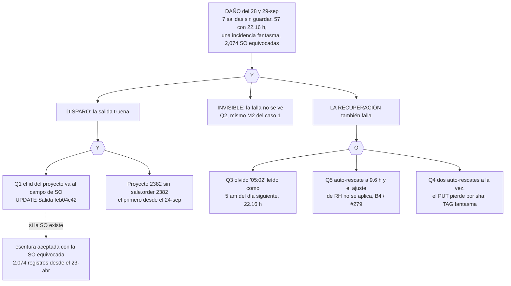

# Kiosko de asistencias · Caso 2: salida con SO11855 (28-sep-2026)

Análisis, sin construcción. Todas las horas en UTC y en CST (Monterrey, UTC-6). Ids de Odoo y de ejecuciones de n8n tal como salieron de los reads; sin nombres de personas (CLAUDE.md §9).

Prueba ejecutable: `node tests/kiosko-blindaje/caso2.test.js` (17 ✓ 0 ✗). Prototipo de pantalla: `prototipo-ampm.html`.

## 1. Qué pasó

### 1.1 La causa raíz A: el id del proyecto va al campo de SO

- El kiosko manda `so_id`, pero el valor es el id de un **`project.project`** (`kiosk.js:1108`, `K.soSeleccionada.id`; la lista viene de proyectos).
- `kiosk/checkin` (`a7mEjjdwIzzvomXs`), nodo "Odoo - UPDATE Salida", en la versión `feb04c42` escribía ese valor en **dos** campos: `x_studio_project_id` (many2one a `project.project`, correcto) y `x_studio_sales_order_2` (many2one a `sale.order`, incorrecto).
- Mientras existiera un `sale.order` con ese mismo número, Odoo aceptaba la escritura **en silencio** con una SO equivocada. El proyecto 2382 se creó el 24-sep 23:35 UTC (17:35 CST); no existe `sale.order` 2382, y la escritura truena con
  `insert or update on table "hr_attendance" violates foreign key constraint "hr_attendance_x_studio_many2one_field_gHzp7_fkey"`.
- La SO real de ese proyecto es SO11855 = `sale.order` 12054 (`sale.order.project_id = 2382`; el lado del proyecto, `project.project.sale_order_id`, está vacío).
- Datos sucios medidos: 2,081 asistencias con `x_studio_sales_order_2` puesto desde el 23-abr-2026, de las cuales 7 ya se corrigieron a mano el 29-sep: quedan **2,074** con el id del proyecto en el campo de SO.

### 1.2 Línea de tiempo B

| UTC | CST | Qué | Fuente |
|---|---|---|---|
| 24-sep 23:35 | 24-sep 17:35 | Se crea el proyecto 2382 | Odoo `project.project` 2382 `create_date` |
| 28-sep 23:00 a 23:07 | 28-sep 17:00 a 17:07 | 10 ejecuciones en error de salida con proyecto 2382: 117659, 117664, 117667, 117670, 117683, 117703, 117718, 117722, 117738, 117744. Registros: empleado 121/att 15728, 127/15735, 131/15729, 57/15734, 25/15731, 76/15732, 128/15733, 79/15737 | n8n, `a7mEjjdwIzzvomXs` |
| 28-sep 23:01 | 28-sep 17:01 | Empleado 131 cierra con un olvido de salida a las 17:01 | almacén de incidencias |
| 29-sep 11:02 | 29-sep 05:02 | Empleado 57, olvido de salida tecleando "05:02" (exec 118408): `check_out` 11:02 UTC del día siguiente, 22.16 h | n8n 118408, Odoo 15734 |
| 29-sep 12:27:36 y 12:35:25 | 06:27:36 y 06:35:25 | Empleado 79, salida falla otra vez (118344, 118371) | n8n |
| 29-sep 12:29:11 | 06:29:11 | Empleado 121, salida falla (118352) | n8n |
| 29-sep 12:33:01 | 06:33:01 | Empleado 121, auto-rescate al checar entrada: cierre a 9.6 h con TAG | n8n |
| 29-sep 12:40:30 | 06:40:30 | Empleado 25, auto-rescate | n8n |
| 29-sep 12:53:39 | 06:53:39 | Hotfix: versión `a0c4b0e8` publicada, = `feb04c42` sin `x_studio_sales_order_2` en "Odoo - UPDATE Salida" | `get_workflow_history` + `get_workflow_versions_diff` |
| 29-sep 12:59:33 y 12:59:34 | 06:59:33 y 06:59:34 | Empleados 128 y 79, auto-rescate simultáneo. La de 79 (exec 118442) truena en el PUT del almacén por choque de sha: Odoo ya tenía el TAG, el almacén no tiene la incidencia `INC-AUTO-CIERRE-79-2026-09-29T12-59-35-580Z` (fantasma). Entre 12:59 y 13:02 UTC solo corren 118440, 118441 y 118442: no hubo reintento | n8n |

Correcciones manuales C (hechas por F12, no se repiten ni se revierten): las 7 salidas a su hora real con proyecto 2382 y SO 12054; las entradas del 29-sep de 15760 y 15751; el TAG fantasma de 15737 limpio. Las incidencias pendientes siguen para RH; en la de 57, RH ajusta a "17:02".

## 2. Árbol de falla

Medido con el simulador: se quitó una pieza a la vez y se corrió el mismo guion (28-sep 17:00 CST a 29-sep 07:00 CST, los 8 empleados).

| Pieza quitada | Salidas del lunes guardadas | Horas de 57 | Incidencia fantasma | Ajuste de RH perdido (I6) | SO equivocada (I10) |
|---|---|---|---|---|---|
| Ninguna (lo que pasó) | 0 de 7 | 22.16 | sí | sí | sí |
| Q1 · B11: el id del proyecto nunca va al campo de SO | **7 de 7** | **10.16** | **no** | **no** | **no** |
| Q2 · B1: la falla se ve y el empleado declara su salida esa tarde | 7 de 7 | 10.16 | no | no | sí |
| Q3 · B9: guarda AM/PM en olvidé salida | 1 de 7 | 10.16 | sí | sí | sí |
| Q4 · B12: el PUT del almacén reintenta con sha fresco | 0 de 7 | 22.16 | no | sí | sí |
| Q5 · B4: resolver aplica la hora de RH al auto-cierre | 1 de 7 | 22.16 | sí | no | sí |

Lectura:
- **Q1 sola evita todo el caso.** Es la única pieza que corta el disparo; las demás solo reducen el daño.
- **Q2 (B1) sola salva las 7 salidas** siempre que el empleado, al ver el error, declare su salida esa tarde (modelado como reacción; qué vio cada pantalla el 28-sep no está medido). Deja la SO equivocada, porque el olvido tampoco valida el id.
- **Q3, Q4 y Q5 solo tapan una grieta cada una.** Por eso el caso se ve como "muchas cosas a la vez": un solo disparo abrió tres caminos de recuperación, y los tres tenían su propio defecto.
- Hallazgo del simulador sobre B9: con la guarda AM/PM tal como estaba en el plan, 57 corrige a "17:02", pero esa hora queda 13.6 h atrás y el límite de 12 h de "olvidé salida" la rechaza, mientras que el "05:02" equivocado sí pasa (por estar mal). **La hora que el empleado ya confirmó no debe caer en el límite de 12 h.** Con ese ajuste, B9 deja a 57 en 10.16 h.

## 3. Relacionados o distintos

| Hallazgo del caso 2 | Pieza del caso 1 con la que se cruza | Veredicto | Bloque |
|---|---|---|---|
| A. Id del proyecto en el campo de SO; FK con 2382 | Ninguna | **Hueco nuevo.** Anotado el 27-sep en #326 sin perseguir; el Paso E de `docs/finanzas/MIGRACION_PROJECT_ID.md` ("dejar de escribir el campo viejo") quedó a medias | B11, B13 |
| La salida no llega a Odoo | P1 (la salida del jueves no llegó) | **Mismo efecto, causa distinta.** Caso 1: la red; caso 2: el servidor rechaza | B11 |
| La falla no se ve | P3 y M2 (workflow truena sin Respond, 200 sin JSON, el kiosko pinta éxito) | **Causa común.** El build en `main` sigue siendo `20260710-kiosk-versioncheck`; B1 está en borrador, sin publicar | B1 |
| D4. El checkin no responde, o responde error aunque Odoo escribió | M2 y M3 | **Causa común**, y en el caso 2 aparece del lado del almacén: Odoo escribió el TAG y el PUT falló | B1, B12 |
| Auto-rescate a 9.6 h al día siguiente, y RH no puede ajustarlo | M4, #279, B4 | **Causa común** (D2 de este caso = B4) | B4 |
| D1. "05:02" leído como 5 am (15490, 14715, 14476 y otros) | Pre-mortem "AM/PM en olvidé salida" (14966) | **Hueco conocido**, con bloque (B9) que necesitaba un ajuste: exentar la hora confirmada del límite de 12 h | B9 |
| D3. Tres workflows hacen GET y luego PUT del almacén sin reintento | Pre-mortem "doble envío" (exec 99872 y 99873) | **Hueco conocido sin bloque.** En el caso 1 se anotó y ningún bloque lo cubría | B12 (nuevo) |
| D5. El kiosko ofrece proyectos sin SO ligada | Ninguna | **Hueco nuevo**, consecuencia de A: el kiosko no sabe qué SO tiene cada proyecto | B11 |
| D6. Consumidores de `x_studio_sales_order_2` sin verificar | Ninguna | **Hueco nuevo**, medido en la §5: hay un lector que reparte nómina con ese campo | B11 (orden de despliegue), B13 |

**Veredicto general:** el disparo del caso 2 es un hueco nuevo (A), pero el daño lo amplificaron los mismos huecos del caso 1: la falla invisible (M2), el auto-cierre que RH no puede corregir (M4) y la guarda AM/PM que faltaba. No es coincidencia que se crucen: cualquier disparo nuevo va a pasar por esos mismos tres caminos de recuperación mientras B1, B4 y B9 no estén en producción.

## 4. Invariantes nuevas

Ver `invariantes.md`: I10 (ids validados), I11 (ninguna escritura del almacén se pierde; ningún TAG apunta a una incidencia inexistente), I12 (una hora ambigua de 12 h nunca se interpreta sin confirmación), y la extensión de I2 (si el PUT falla después de que Odoo escribió, la respuesta dice la verdad de las dos cosas).

## 5. Consumidores de `x_studio_sales_order_2`

Barrido del 29-sep sobre las 180 workflows de la instancia (96 activas): 151 leídas completas (borrador y publicada cuando difieren), 29 no legibles por MCP (`availableInMCP:false`). `x_studio_many2one_field_wyDLM` y `x_studio_many2one_field_gHzp7` no aparecen en ninguna legible.

| Workflow | Id | Nodo | Uso | Efecto |
|---|---|---|---|---|
| `planeacion/confirmar-horas` | `7D3lgaYmH2DmqCWy` | Odoo - UPDATE SO+Approval | **Escribe** `x_studio_sales_order_2 = so_id` (id de proyecto) | **FK viva** para el proyecto 2382: confirmar hacia SO11855 truena. Con otros proyectos graba una SO equivocada en silencio. Está en la publicada `7a45cadc` y en el borrador B1 `a85fb82d` |
| `planeacion/corregir-bolsa` | `O61Abp4s26yYpFEq` | Odoo - UPDATE Proyecto | **Escribe** `x_studio_sales_order_2 = so_id` | Igual. Publicada `183acaa5`, borrador B1 `06b897f3` |
| `planeacion/corregir-bolsa` | `O61Abp4s26yYpFEq` | Odoo - UPDATE Bolsa | Escribe `false` | Inocuo |
| `fts_bancos_estado_resultados` | `LW3DVENZjlI3Kurp` | Odoo - Asistencias → `calcular.js` | **Lee.** `bancos/edo_resultados/calcular.js:378` en el commit fijado `5fa7c374`: `if (a.x_studio_sales_order_2) o.p += h; else if (a.x_studio_many2one_field_GUbBF) o.c += h;` | Reparte la nómina por horas a proyecto cuando no hay Carga MO del mes. **Solo le importa si el campo está lleno, no qué SO es.** Si se deja de escribir sin cambiar este lector, las horas a proyecto nuevas se cuentan como no medidas. Ya pasa con las salidas del kiosko desde el hotfix (29-sep 12:53 UTC, 06:53 CST) |
| `nom/semana` | `w7NNmtukDvrXKkOk` | Odoo - Disputas, Code - Ensamblar | **Lee** y muestra: `propuesta: m2oName(at2.x_studio_sales_order_2)` | Muestra el nombre de la SO equivocada en disputas (p. ej. SO2286 para el proyecto 2302) |
| `planeacion/horas-dia` | `pQ3vVbRkMYvfICQf` | Odoo - SEARCH Asistencias | Lo pide en `fieldsList` y no lo usa (usa `x_studio_project_id`) | Ninguno |
| `kiosk/checkin` | `a7mEjjdwIzzvomXs` | Odoo - UPDATE Salida | Ya no lo escribe desde `a0c4b0e8` | Resuelto por el hotfix |

Repo (`main`): `operaciones/confirmar-horas/js/confirmar-horas.js:4` (comentario), `operaciones/confirmar-horas/README.md:27`, y documentos en `docs/finanzas/` y `docs/operaciones/`. Ningún frontend lee el campo.

No se pudo verificar (29 workflows sin acceso por MCP). Las que más probablemente tocan `hr.attendance`: `kiosk/cerrar-registro` (`WkgYjDeL2kQInz3H`), `asistencias/admin` (`Bqnfsx8gx2TpzfwM`), `dashboard/resumen` (`nNNQrFMTSjIfqHep`), `planeacion/dia` (`3NjfelLFVcIWOe9N`), `planeacion/guardar` (`IDzF71h0f1EYHVhH`), `accesos-incidencias/guardar` (`HwPq9dqxjy2KETi7`).

Quién usa `x_studio_project_id` (el campo correcto): escriben `kiosk/checkin`, `confirmar-horas` y `corregir-bolsa`; leen `horas-dia`, Carga MO (`HV1UE5JxN5fKdC2Y` y `j0V9wfpuPTLFO9DZ`), `fin/rentabilidad-motor` (`sBnP4IEBgJFAeanx`), `ops/eco-confirmacion` (`GbO7iFHg6NIE5rat`) y `ops/watchdog-mo` (`RBxoREDTfehELmyr`).

### 5.1 Opciones (propuesta, no se construye)

| Opción | Qué es | A favor | En contra |
|---|---|---|---|
| **1. Mapear proyecto a SO** | Toda escritura pone en el campo de SO la SO real del proyecto (`sale.order` con `project_id = pid`), o vacío si no hay | El campo sigue sirviendo a `nom/semana` y al estado de resultados sin tocarlos | 5 de 21 proyectos con horas no tienen la liga (SO11557, SO11511, SO11526, SO11644, SO11547); SO11526 tiene dos proyectos; una consulta más por escritura. Dos campos que deben coincidir = dos escritores de la verdad (CLAUDE.md §20 #4) |
| **2. Dejar de escribirlo (congelar)** (recomendada) | Nadie escribe el campo; los lectores pasan a `x_studio_project_id`. Es el Paso E de la migración ya decidida (Opción 2, 2026-07-07) | Un solo campo de verdad. Cero consultas extra. El kiosko ya está así desde el hotfix | Hay que cambiar primero dos lectores: `calcular.js:378` (condición a `x_studio_project_id`) y `nom/semana` (mostrar el proyecto). Si se invierte el orden, el estado de resultados cuenta mal |
| **3. Borrar el campo en Studio** | Eliminarlo | Nadie puede volver a escribirlo | Irreversible; hay 29 workflows que no se pudieron leer; rompe cualquier lector no visto con error de campo inexistente |

Orden de despliegue de la 2 (regla anti-trabón, CLAUDE.md §8): primero los lectores (tolerantes: `calcular.js` acepta cualquiera de los dos campos), después los escritores (`confirmar-horas` y `corregir-bolsa` dejan de escribirlo), fuera de 07:00 a 18:00 CST.

### 5.2 Los 2,074 registros históricos

| Camino | Cómo | Cubre | Riesgo |
|---|---|---|---|
| a. Reescribir a la SO real por el prefijo del nombre del proyecto ("SO11855 · …") | Script de un solo uso, con lista de cambios revisada antes | 21 de 21 grupos con proyecto (2,080 registros; 1 sin proyecto) | El nombre es texto libre; hay que revisar el mapeo a mano antes de escribir |
| b. Reescribir por la liga `sale.order.project_id` | Igual | 16 de 21 grupos (unos 1,306 registros) | Deja 5 grupos sin mapear, entre ellos SO11547 con 766 |
| c. Vaciar el campo | Escribir `false` | Todos | Pierde la pista si alguien la usaba; el estado de resultados deja de contar esas horas como proyecto hasta que cambie su lector |
| d. No tocarlos | Nada, y marcar el campo como obsoleto | n/a | `nom/semana` sigue mostrando SO equivocadas en disputas viejas |

Con la opción 2, el camino natural es **c después de cambiar los lectores**, o **d**: nadie volvería a leer el campo. La decisión es de Dirección.

## 6. Horas infladas por "05:0x"

Fuente: las 35 incidencias `olvido_checkout` del almacén `shared/incidencias-asistencia.json` en `main` (32 aprobadas, 3 pendientes), cruzadas con `worked_hours` de Odoo leído el 29-sep. "Probable" = la misma hora tecleada leída 12 h antes (de la tarde del mismo día). Solo se cuantifica; #279 decidió no corregir el histórico de auto-cierres, y qué hacer con estos es decisión aparte.

| att | Empleado | Horas hoy | Tecleada | Probable | Diferencia |
|---|---|---|---|---|---|
| 15490 | 121 | 22.68 | 05:00 | 10.68 | 12.00 |
| 14966 | 124 | 22.12 | 05:05 | 10.12 | 12.00 |
| 14774 | 62 | 22.05 | 06:04 (ajustada 06:04) | 10.05 | 12.00 |
| 14715 | 57 | 22.13 | 05:04 | 10.13 | 12.00 |
| 14476 | 79 | 22.51 | 05:00 | 10.51 (10.01 si vale la nota del supervisor "4:30 pm") | 12.00 (12.50) |
| 13882 | 6 | 22.32 | 05:11 | 10.32 | 12.00 |
| 13243 | 62 | 21.66 | 06:30 | 9.66 | 12.00 |
| 12865 | 62 | 22.01 | 05:35 | 10.01 | 12.00 |
| **Total** | | | | | **96.0 h (96.5 h)** |

Ambiguos, fuera del total: 12848 (121, 16.35 h, tecleada 23:01) y 13106 (127, 20.09 h, `check_in` 02:54 UTC = 20:54 CST del día anterior, posible turno nocturno). 15734 (57, el del caso 2) ya está en 10.16 h tras el F12.

Contexto: desde el 23-abr hay 33 asistencias con más de 16 h. Unas 22 son el patrón de ~24 h de "Seguí en turno" (D4 del caso 1), y una es 13224 con 131.60 h. Esas no entran en esta tabla porque no vienen de un "05:0x".

## 7. Plan

Ver `plan.md` (orden unificado, B11 a B13). Siguiente bloque a construir: **B11**.
