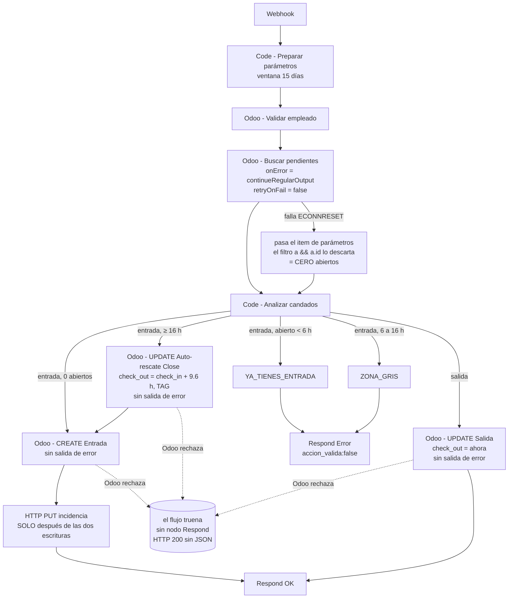
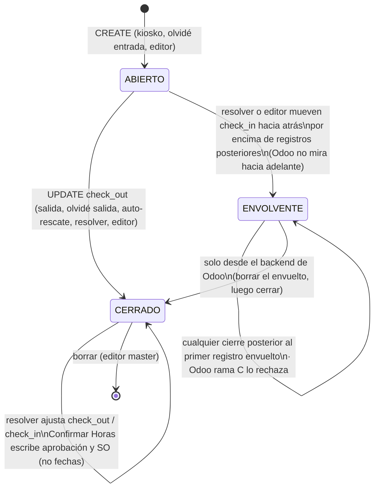
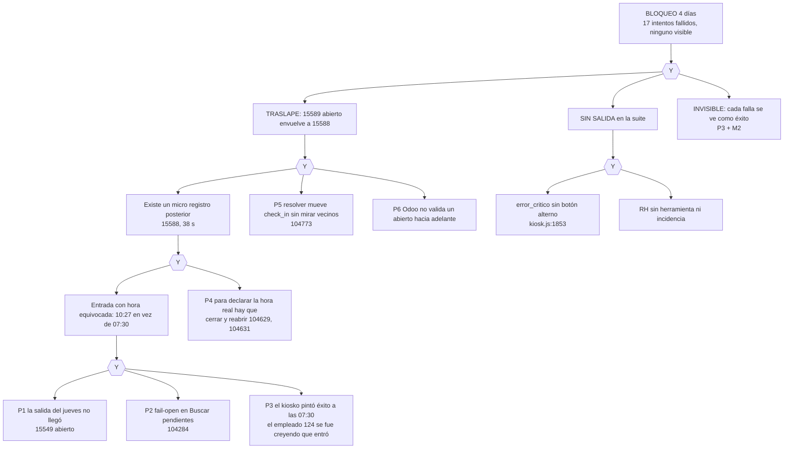

# Kiosko de asistencias · Modelo de falla (cómo funciona HOY)

Sesión 0: modelar y diseñar, sin construir. Todas las horas en CST (UTC-6) con el UTC entre paréntesis cuando importa. Cada afirmación lleva su fuente: archivo y línea, id de workflow y nodo, id de ejecución de n8n o id de registro de Odoo.

Piezas que intervienen:

| Pieza | Dónde vive | Qué hace con `hr.attendance` |
|---|---|---|
| Kiosko | `operaciones/kiosk/js/kiosk.js`, `operaciones/kiosk/js/odoo.js` | Pinta el estado y manda entradas, salidas y olvidos |
| `kiosk/estado-empleado` | n8n `U13fngg2dTKgDQ8Y`, nodo "Code - Clasificar estado" | Lee abiertos de los últimos 15 días y clasifica 14/24 h |
| `kiosk/checkin` | n8n `a7mEjjdwIzzvomXs` (26 nodos) | CREATE entrada, UPDATE salida, auto-rescate de 16 h o más |
| `incidencias/crear-olvido-entrada` | n8n `JLiuczUd61xVNp36` | Incidencia paralela a una entrada normal |
| `incidencias/crear-olvido-checkout` | n8n `IRtG38Aknb5SW15h` | UPDATE `check_out` con la hora declarada + TAG + incidencia |
| `incidencias/resolver` | n8n `Oc2ceMHX2O0L0y2X`, nodo "Code - Aplicar accion" | Escribe `check_in` o `check_out` solo en `olvido_*` con ajustar o rechazar |
| Panel de incidencias | `shared/mi-perfil/panel-incidencias/index.html` | Llama a `resolver`, pide hora (L920-924) |
| Confirmar Horas | `operaciones/confirmar-horas/`, n8n `pQ3vVbRkMYvfICQf` y `7D3lgaYmH2DmqCWy` | Lee por `check_in`, escribe aprobación y SO; nunca fechas |
| Editor de asistencias | `shared/admin/editor-asistencias.html`, n8n `Bqnfsx8gx2TpzfwM` | Solo `ftsmaster`. Escribe y borra cualquier registro. El workflow NO está habilitado para MCP: no se pudo leer |
| `rh/watchdog/sin-checkin` | n8n `Q19zFeJQytSfBjdb`, nodo "Code - MAIN" | Correo si 5 días hábiles sin `check_in` |
| `nom/semana` | n8n `w7NNmtukDvrXKkOk`, nodo "Code - Ensamblar" | Cuenta días por `check_in`; disputas por TAG |

## 1. La validación nativa de Odoo, deducida

No hay acceso al código de Odoo SaaS. Esto es lo que se deduce de los mensajes que devolvió producción, completado con la lógica pública de Odoo 17 para la rama que ninguna ejecución observó. Está implementado en `tests/kiosko-blindaje/odoo-modelo.js` (método `validar`).

| Rama | Condición | Mensaje | Evidencia |
|---|---|---|---|
| A | El registro que empieza antes de mi `check_in` sigue abierto sobre mi `check_in` | "already checked in on X" (X = su `check_in`) | **No observada.** Lógica pública de Odoo 17 |
| B | Yo quedo abierto y hay **otro** abierto | "hasn't checked out since X" (X = el `check_in` del otro abierto) | exec 104284, nodo "Odoo - CREATE Entrada": `hasn't checked out since 09/17/2026 06:58:11 AM` |
| C | Estoy cerrado y el último registro que empieza antes de mi `check_out` no es el mismo que empieza antes de mi `check_in` | "already checked in on X" (X = el `check_in` de ese registro) | exec 105451 ("Odoo - UPDATE Salida") y 15 más ("Odoo - UPDATE Auto-rescate Close"): `already checked in on 09/18/2026 10:27:49 AM`, que es el `check_in` de 15588. Traceback `hr_attendance.py, line 244, in _check_validity` |

**Consecuencia:** un registro **abierto** solo se compara contra el anterior (A) y contra otros abiertos (B). **Nadie mira hacia adelante.** Por eso resolver 104773 pudo escribir `check_in = 13:30 UTC` en 15589 (abierto) aunque 15588 empezaba después, y el traslape solo apareció al intentar cerrarlo (C). La reproducción da los mismos dos mensajes, carácter por carácter (`caso-124.test.js`, primeras dos pruebas).

## 2. Máquina de estados, HOY

### 2.1 Lo que ve el empleado (kiosko + `estado-empleado`)

`estado-empleado` toma el abierto más reciente **con `check_in` en los últimos 15 días** y lo clasifica por horas: activo < 14 h, zona gris < 24 h, error crítico ≥ 24 h ("Code - Clasificar estado": `UMBRAL_ZONA_GRIS = 14`, `UMBRAL_ERROR_CRITICO = 24`; "Code - Preparar parámetros": `hace15Dias`). Los botones salen de `renderEstadoBotones` (`kiosk.js:1801-1864`).

```mermaid
stateDiagram-v2
    direction LR
    [*] --> SIN_REGISTRO
    SIN_REGISTRO: SIN_REGISTRO\n(sin abierto en 15 días)
    ACTIVO: ACTIVO\n(abierto < 14 h)
    ZONA_GRIS: ZONA_GRIS\n(abierto 14 a 24 h)
    ERROR_CRITICO: ERROR_CRITICO\n(abierto ≥ 24 h)
    FANTASMA: HUÉRFANO FUERA DE VENTANA\n(abierto > 15 días; el kiosko\nlo pinta como SIN_REGISTRO)

    SIN_REGISTRO --> ACTIVO: empleado · "Registrar entrada" (kiosk.js:1812)\nsistema · CREATE check_in=ahora\nOdoo · rama B si hay otro abierto
    SIN_REGISTRO --> ACTIVO: empleado · "Llegué pero olvidé checar entrada" (kiosk.js:1835)\nCREATE con la hora ACTUAL + incidencia olvido_entrada
    ACTIVO --> SIN_REGISTRO: empleado · "Checar salida" (kiosk.js:1815)\nUPDATE check_out=ahora · Odoo rama C
    ACTIVO --> SIN_REGISTRO: empleado · "Salí pero olvidé checar salida" (kiosk.js:1840)\nsolo si la hora es ≤ 12 h atrás (kiosk.js:2037)
    ACTIVO --> ZONA_GRIS: tiempo (14 h)
    ZONA_GRIS --> SIN_REGISTRO: empleado · "Seguí en turno" (kiosk.js:1818)\ncierra con la hora ACTUAL: turno de 14 a 24 h sin TAG
    ZONA_GRIS --> SIN_REGISTRO: empleado · "Olvidé checar salida" (kiosk.js:1851)\nrechazado si la salida fue hace > 12 h
    ZONA_GRIS --> ERROR_CRITICO: tiempo (24 h)
    ERROR_CRITICO --> ACTIVO: empleado · "Resolver ahora" (kiosk.js:1821, 1905)\n= entrada · servidor: auto-rescate cierra a 9.6 h + TAG\ny crea entrada con la hora del CLIC
    ERROR_CRITICO --> ERROR_CRITICO: "Resolver ahora" con el cierre rechazado por Odoo\n(rama C) · el kiosko muestra ÉXITO
    SIN_REGISTRO --> FANTASMA: tiempo (15 días con un abierto)
    FANTASMA --> FANTASMA: "Registrar entrada" · Odoo rama B\n· el kiosko muestra ÉXITO
```

Detalles que el diagrama no dice:

- En `error_critico` no hay botón secundario (`kiosk.js:1853-1855`). `resolverErrorCritico` solo abre el modal de olvidé salida si `horas < 16` (`kiosk.js:1905-1911`), pero `error_critico` empieza en 24 h: **ese camino es inalcanzable**. Corrección al hecho 6 de la semilla: el modal "olvidé salida" sí es alcanzable en `activo` y en `zona_gris` (botones secundarios, `kiosk.js:1840` y `1851`), pero su validación rechaza salidas de hace más de 12 h (`kiosk.js:2037`).
- "Llegué pero olvidé checar entrada" solo existe en `sin_registro` (`kiosk.js:1835`). En `activo` no hay forma de corregir la hora de una entrada.
- El servidor NO usa los mismos umbrales: `kiosk/checkin` ("Code - Analizar candados") bloquea la entrada si el abierto tiene < 6 h, responde ZONA_GRIS entre 6 y 16 h y hace auto-rescate desde 16 h. Entre 16 y 24 h el kiosko pinta zona gris (sin botón de entrada) aunque el servidor ya rescataría.

### 2.2 Lo que hace el servidor (`kiosk/checkin`, `a7mEjjdwIzzvomXs`)

`CRASH` está medido: log HTTP de Railway, servicio Primary, `POST /webhook/kiosk/checkin` 200 en 2.5 s para las ejecuciones fallidas 105451, 107543, 107545, 108971, 108973, 108985.

### 2.3 El registro en Odoo

### 2.4 Transiciones por actor

| Actor | Transición | Escribe en Odoo | Respuesta de Odoo posible | Qué ve la persona |
|---|---|---|---|---|
| Empleado | Entrada | CREATE `check_in` | Rama B si hay otro abierto | Éxito siempre, salvo candado 6/16 h |
| Empleado | Salida / "Seguí en turno" | UPDATE `check_out` = ahora | Rama C si hay un registro posterior | Éxito siempre |
| Empleado | "Resolver ahora" | UPDATE cierre + CREATE | Rama C en el cierre, B en el CREATE | Éxito siempre |
| Empleado | Olvidé entrada | CREATE (hora actual) + incidencia | Rama B | Éxito; si el POST cayó en el catch no se crea la incidencia (`kiosk.js:1223`) |
| Empleado | Olvidé salida | UPDATE `check_out` declarado + TAG | Rama C | Este camino sí muestra error (alert en el catch de `confirmarOlvideCheckout`) |
| Sistema | Auto-rescate | UPDATE `check_out` = +9.6 h + TAG | Rama C | (lo ve el empleado como éxito) |
| Supervisor | aprobar / escalar en `resolver` | Nada | n/a | "✓ aplicada" |
| RH | ajustar `olvido_entrada` | UPDATE `check_in` | Pasa aunque envuelva registros si el registro está abierto | "✓ aplicada" |
| RH | ajustar `olvido_checkout` | UPDATE `check_out` | Rama C | Error de conexión en el panel si el flujo truena (NO VERIFICADO en vivo) |
| RH | ajustar o aprobar `auto_cierre_pendiente` | **Nada** (solo limpia TAG) | n/a | "✓ aplicada" (resolver 104680, 102993) |
| RH | aprobar `olvido_entrada` | **Nada** | n/a | "✓ aplicada" aunque tecleó la hora (panel L920-924 la exige) |
| Master | Editor: escribir o borrar | Cualquier campo, sin validar traslapes (L1418-1460) | A, B, C | 200 JSON sin `success:false` = éxito (L764-767) |
| Cron | No existe cron de cierre. El watchdog solo manda correo | Nada | n/a | Correo "sin checar ≥ 5 días hábiles" |

## 3. Estados sin salida (deadlocks)

| # | Estado | Por qué no hay salida | Evidencia |
|---|---|---|---|
| D1 | **Abierto envolvente** (un abierto con registros posteriores adentro) | Todo cierre posterior al primer registro envuelto lo rechaza la rama C: salida, auto-rescate y olvidé salida. El kiosko solo ofrece "Resolver ahora". RH no tiene incidencia sobre la cual actuar (el auto-rescate fallido no persiste la suya: el PUT va después de las escrituras). Solo el backend | 17 ejecuciones fallidas de hr.employee 124 (104284, 105451, 107543 … 109267) |
| D2 | **Huérfano fuera de ventana** (abierto de más de 15 días) | `estado-empleado` y `kiosk/checkin` no lo ven (ventana 15 días): el kiosko dice "Sin entrada" y ofrece entrada; Odoo rechaza con rama B. Nadie en la suite lo ve | Registro 13373 (hr.employee 132, inactivo, abierto desde 2026-05-28 06:55 (12:55 UTC), único abierto hoy). Si se reactiva, cae aquí |
| D3 | **Error crítico con Odoo que no responde** | Cada "Resolver ahora" falla abierto, intenta CREATE y Odoo lo rechaza (rama B); la pantalla dice éxito. Se destraba solo cuando Odoo vuelve, pero nadie se entera | exec 104284 |
| D4 | **Zona gris de 16 a 24 h** (no es deadlock, es salida falsa) | Sin botón de entrada; el modal de olvidé salida rechaza salidas de hace > 12 h; la única salida aceptada es "Seguí en turno", que registra un turno de 16 a 24 h sin TAG | 25 registros de 20 h o más desde el 1-jun (15611, 15490, 15372, 15364, 15247, 15035, 14966, 14964, 14960, 14895, 14831, 14774, 14735, 14715, 14671, 14476, 14356, 14071, 14041, 13896, 13895, 13882, 13880, 13618, 13506) |

## 4. Caminos donde la pantalla dice una cosa y Odoo tiene otra

| # | Camino | Pantalla | Odoo | Evidencia |
|---|---|---|---|---|
| M1 | Red cae o servidor tarda > 10 s (HTTP 499) | Confirmación de éxito (se pinta antes del POST, `kiosk.js:1127`; el catch solo pone `checkinOk=false`, `kiosk.js:1199-1203`) | Nada, o lo que el servidor alcanzó a hacer | Railway: 3 × 499 a las 07:30 del vie 18 (exec 104284) |
| M2 | El workflow truena en cualquier escritura | Éxito: 200 sin JSON hace fallar `return res.json()` (`odoo.js:33`, no está esperado dentro del try) y cae al mismo catch | Nada | Railway 200 en 105451, 107543, 107545, 108971, 108973, 108985 |
| M3 | Servidor lento + reintento automático (`odoo.js:17`) | Error "ya tienes entrada" | La entrada SÍ quedó (primer intento) | exec 102523 (hr.employee 78, 13 s, éxito) y 102525 (12 s después, Respond Error); Railway 499 a las 08:30:29 (14:30:29 UTC) |
| M4 | RH "ajusta" o "aprueba" un auto-cierre | "✓ aplicada" | Sigue en 9.6 h | resolver 104680 (`aplicaHora:false`, `odoo_aplicado:false`), 102993 |
| M5 | RH "aprueba tal cual" un olvido de entrada | "✓ aplicada" con la hora tecleada | Conserva la hora del kiosko | `shared/incidencias-asistencia.json`: INC-OLV-124-2026-05-08T13-32-59-618Z e INC-OLV-124-2026-05-11T13-20-27-589Z con `aplicado_en_odoo:false` |
| M6 | Confirmar Horas | Marca confirmado sin releer (`confirmar-horas.js:494-497`) | Si el UPDATE truena (sin onError en `7D3lgaYmH2DmqCWy`), la respuesta tampoco llega; el cliente lo cuenta como error solo si no es JSON | Auditoría de código |
| M7 | Editor de asistencias | 200 JSON sin `success:false` = éxito, sin releer (L764-767, L1515-1531) | Depende del workflow no auditable | Auditoría de código |
| M8 | Mensaje del servidor ignorado | El kiosko no muestra `mensaje` | exec 104626 respondió "Entrada estimada registrada. Pendiente validación del supervisor." | exec 104626 |

## 5. Árbol de falla del caso del empleado 124

**Medido con el simulador** (`node tests/kiosko-blindaje/arbol.test.js`): se quitó una pieza a la vez y se corrió la misma semana.

| Pieza quitada | ¿Traslape? | ¿Bloqueo? |
|---|---|---|
| Ninguna (lo que pasó) | sí | sí: 4 intentos fallidos desde el vie 17:00 en el guion, sin salida para empleado ni RH |
| P1 · la salida del jueves llega | no | no |
| P2 · la lectura no falla abierto | no | no |
| P3 · el kiosko dice que falló a las 07:30 (reintenta 07:33) | no | no |
| P4 · se puede declarar la hora real sin cerrar y reabrir | no | no |
| P5 · resolver revisa vecinos antes de mover el `check_in` | no | no |
| P6 · Odoo validara hacia adelante (hipotético) | no | no |
| P7 · hay salida para empleado y RH | sí | sigue fallando el guion, pero existe salida (sin I4) |

Lectura: **cualquiera de P1 a P6, quitada sola, habría evitado el bloqueo**. Ninguna era suficiente sola; hizo falta la conjunción. P6 no se puede cambiar (Odoo SaaS sin módulos custom), P1 y P2 son fallas externas (red, Odoo) que van a volver a pasar. Las piezas de diseño que están en nuestras manos y cortan el árbol son **P3, P4 y P5**; P7 no corta el traslape pero convierte un bloqueo de días en uno de minutos.

## 6. Pre-mortem: otros caminos al mismo lugar

| Camino | Qué pasa hoy | Resultado | Fuente |
|---|---|---|---|
| Servidor lento + reintento + baile (sin auto-rescate) | La primera ejecución crea la entrada, el reintento recibe "ya tienes entrada", la pantalla dice error; el empleado cierra para declarar su hora y RH ajusta hacia atrás | **Mismo traslape que el del empleado 124**, sin que haya auto-rescate | Contraejemplo mínimo del simulador (3 eventos: `lento`, entrada tardía, RH). M3 lo respalda en producción |
| Turno nocturno | T2 22:30 a 07:00 sin salida; vuelve a las 20:00 del mismo día: 21.5 h → zona gris; olvidé salida rechaza (> 12 h); "Seguí en turno" registra 21.5 h sin TAG | Horas falsas | D4; umbral de 16 h documentado para T2 en "Code - Analizar candados" |
| Ventana de 15 días | Abierto de más de 15 días: invisible y bloqueante | D2 | 13373 |
| Ajuste de RH hacia atrás | Sobre un abierto con registros posteriores | D1 | resolver 104773 |
| Ajuste de RH hacia adelante | `olvido_checkout` a una hora posterior al siguiente registro: Odoo rama C, `resolver` truena (UPDATE sin onError), el panel dice "Error de conexión" (panel L1101-1126) y la incidencia queda pendiente | RH en un ciclo de reintentos | Código; no observado |
| Falla de red | M1: la salida no llega y el día siguiente cae en auto-rescate a 9.6 h | Horas estimadas en lugar de reales | Jue 17 17:22 (sin ejecución) |
| Doble clic o doble envío | `crear-olvido-checkout` recibió dos POST en 10 ms: Odoo escrito dos veces, la segunda incidencia se perdió por conflicto de sha en GitHub | Incidencia perdida | exec 99872 (error "is at 42d5e37… but expected a5e92da…") y 99873 |
| Reintentos del cliente | M3 | Pantalla de error con la entrada hecha; el empleado repite y ensucia | exec 102523 y 102525 |
| Dos dispositivos | Dos entradas casi simultáneas: ambas leen cero abiertos; la segunda CREATE la rechaza la rama B, el flujo truena y ese dispositivo muestra éxito | Inocuo en datos, pero M2 | Deducción (rama B) |
| Empleado reactivado con huérfano | 13373 si hr.employee 132 vuelve | D2 | Odoo: único abierto hoy es 13373 |
| Guardia legítima > 16 h | El auto-rescate la corta a 9.6 h con TAG; RH "ajusta" y no se aplica (M4) | Horas perdidas | resolver 104680 |
| AM/PM en olvidé salida | "05:05" en vez de "17:05": el ajuste de medianoche (`kiosk.js:2022-2024`) la manda al día siguiente | Turno de ~22 h aprobado tal cual | 14966 (22.12 h, incidencia INC-OLV-CHK-124-2026-08-18T12-48-14-456Z) |
| Editor master | Permite reabrir (`check_out` vacío, L1465) y mover fechas sin revisar traslapes | Puede crear D1 a mano | L1418-1460 |

## 7. Qué no se pudo verificar

- El código de `_check_validity` (Odoo SaaS). La rama A nunca se observó.
- El workflow `asistencias/admin` (`Bqnfsx8gx2TpzfwM`): "Workflow is not available in MCP".
- El cuerpo exacto de los HTTP 200 sin JSON: Railway no guarda cuerpos. No cambia la conclusión: con JSON o sin él, el kiosko queda en la pantalla de éxito (§4, M2).
- Qué ve el panel de RH cuando `resolver` truena al ajustar hacia adelante (no observado en vivo).
- Si el servidor valida el token base64 del editor de asistencias.
