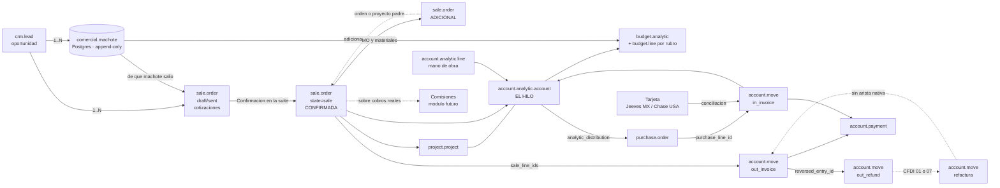
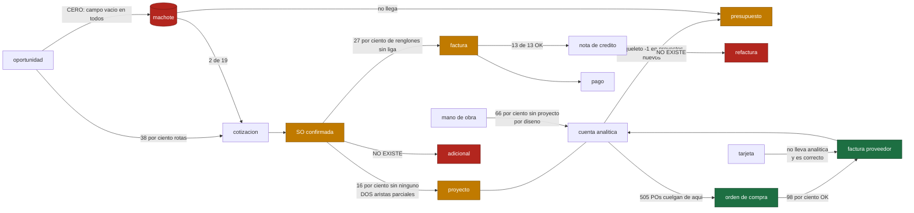

# El grafo objetivo, y el que hay hoy

Los porcentajes son los medidos el 2026-09-24 sobre 2025-01-01 → hoy, compañías 1 y 6.
El detalle de cada número está en [`INFORME.md` §3](INFORME.md).

## 1 · El grafo objetivo

## 2 · El grafo que hay hoy

Verde = la arista funciona. Ámbar = existe y falla a menudo. Rojo = no existe o está en cero.

## 3 · Las cardinalidades del encargo, contra la realidad

| cardinalidad propuesta | ¿se cumple? | medido |
|---|---|---|
| 1 lead → N machotes | **no se puede saber** | la arista no existe: 0 machotes con lead |
| 1 lead → N cotizaciones | **sí** | 698 cotizaciones en 483 oportunidades; ≥215 son la 2ª o posterior |
| cada cotización sabe de qué machote salió | **casi nunca** | 2 de 19 machotes vivos tienen orden |
| 1 lead → varias SO confirmadas | **sí, y es lo normal** | consecuencia de la anterior |
| adicional = SO nueva ligada al padre | **no existe la arista** | no hay campo de orden padre en `sale.order` |
| SO ↔ proyecto ↔ analítica | **sí, pero por dos caminos que no coinciden** | 106 sólo por el nativo, 13 sólo por el del radar, 32 por los dos, 28 por ninguno |
| presupuesto de MO y materiales del machote | **la estructura sí, los montos no** | los proyectos nuevos nacen con `budget_amount = −1` |
| SO → N facturas de todo tipo | **sí** | y el 25 % de ellas sin liga de renglón |
| cada NC ligada a su factura | **sí, nativo** | 13 de 13 |
| cada refactura ligada a la que corrige | **no** | sólo rastro CFDI |
| proyecto → N POs | **sí, por la analítica del renglón** | 505 en 3 proyectos; 0 por cabecera |
| proyecto → N bills | **sí** | 98 % de los renglones ligados a su PO |
| proyecto → gastos de tarjeta y MO | **MO sí; tarjeta por la vía del bill** | ver §4.3 del informe |
| factura/bill → N líneas de pago | **sí** | 98 % de los cobros conciliados |
| SO → comisiones sobre cobros reales | **no existe** | hoy las comisiones viven en el machote y en `budget.line` |
