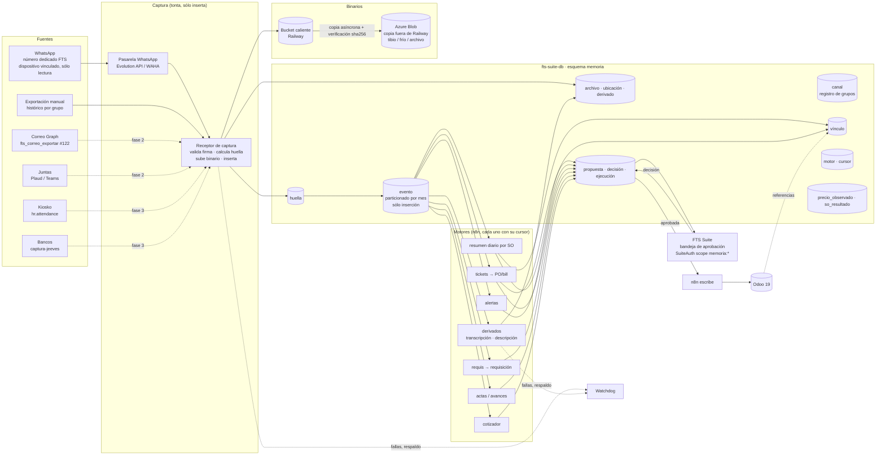

# Memoria de FTS — Arquitectura propuesta (Sesión 0)

> **Estado: PROPUESTA, nada ejecutado.** Este documento no crea servicios, no aplica DDL, no
> toca Odoo ni activa workflows. El DDL de §3 es un borrador para revisión; cuando se apruebe
> se convierte en migraciones numeradas de `db/` (ver §3.0).
>
> Auditoría en la que se basa: [`AUDITORIA.md`](AUDITORIA.md). Plan de construcción:
> [`PLAN.md`](PLAN.md). Issue de respuesta: *WhatsApp · Sesión 0: auditoría y arquitectura*.

---

## 1. Qué es y qué no es

La **memoria de FTS** es una bitácora única, sólo de inserción, de **todo lo que pasa y se
dice** en la empresa, sin interpretar, con vínculos hacia lo que Odoo ya sabe (SO, lead,
PO, bill, empleado). WhatsApp es la **primera fuente**; correo, juntas (Plaud/Teams),
kiosko y bancos se enchufan después a la misma tubería sin cambiar su estructura.

Tres principios que ordenan todo lo demás:

1. **Capturar es barato y tonto; interpretar es caro y se hace después.** La captura sólo
   inserta lo que llegó, con su huella. Nada de IA, nada de Odoo, nada de decisiones en el
   camino de captura. Todo lo inteligente es un **motor** que lee la bitácora con su propio
   cursor y escribe **propuestas**.
2. **Nada se borra, nada se reescribe.** La bitácora es sólo inserción. Una corrección es un
   evento nuevo; una liga equivocada se retracta con otra liga; una decisión se registra,
   no se sobrescribe. Lo único que se descarta es el ruido (§5), y aun así queda su conteo.
3. **La IA propone, una persona aprueba, n8n ejecuta.** Ningún motor escribe en Odoo, ni
   manda un correo, ni publica algo al cliente. Guardamos lo que propuso la IA **y** lo que
   aprobó la persona: la diferencia es la materia prima del aprendizaje del cotizador.

**Lo que no es:** no reemplaza a Odoo (Odoo sigue siendo la base del resultado, igual que
en `docs/comercial/ALMACEN.md`), no es un chat, no escribe en los grupos de WhatsApp y no
es un data lake de binarios (los binarios viven fuera de Postgres, §4).

---

## 2. Vista general



### 2.1 Por qué la captura NO pasa por n8n

Es la decisión de arquitectura más importante de la propuesta, y sale directo de la
auditoría (`AUDITORIA.md` §2 y CLAUDE.md §20 #14): **n8n es un solo proceso de 8 GB,
compartido por el kiosko, Confirmar Horas, Finanzas y el MCP**, y el 18-sep ya se cayó por
memoria con un batch pesado. Meter por ahí cada foto, audio y video de todos los grupos es
poner la carga más voluminosa y menos predecible del sistema en la caja que ya no aguanta.

Por eso la propuesta separa:

| camino | qué pasa por ahí | dónde corre |
|---|---|---|
| **captura** | cada mensaje y cada binario | pasarela WhatsApp + **receptor** propio (servicio pequeño en Railway, red privada) |
| **motores** | lectura por lotes con cursor, llamadas a IA, propuestas | n8n (Schedule, lotes chicos, fuera de horario pico si son pesados) |
| **escritura a Odoo / envíos** | sólo lo aprobado | n8n, como hoy |

El receptor es deliberadamente tonto: valida la firma, calcula la huella, sube el binario
al bucket por *streaming* (sin tenerlo entero en memoria), inserta y responde. Si el
receptor se cae, la pasarela reintenta; si n8n se cae, la captura sigue. **Decisión
abierta D3** si se prefiere empezar por un webhook de n8n para el piloto (más simple, mismo
patrón que el resto de la suite) y mover a receptor propio antes de abrir todos los grupos.

---

## 3. Esquema `memoria` (DDL propuesto, sin ejecutar)

### 3.0 Dónde va a vivir

- **Mismo Postgres `fts-suite-db`**, esquema propio **`memoria`**, hermano de `comercial` (y
  de `po_radar` cuando se aplique). No en la base de n8n (servicio `Postgres`), por las
  mismas razones que ya fijó `ALMACEN.md`.
- El nombre es `memoria` y no `whatsapp` a propósito: la infraestructura es general.
- Se aplica como migraciones de `db/migrations/memoria/` con la **numeración global** de
  `db/README.md` (hoy la última es `009`, así que serían `010_…` en adelante), por el
  runner `comercial/db-migrate`. ⚠️ **Choque de numeración:** `prospector/HISTORIAL.md:876`
  dice que el prospector tiene las migraciones **010–014 escritas y ninguna aplicada** (esquema
  `prospeccion`), fuera de `main`. El número real de las de `memoria` se asigna **al momento de
  aplicarlas** (el siguiente libre en `public.schema_migrations`), nunca antes. En este
  documento `010_memoria_*` es un nombre de trabajo. ⚠️ `db/` está fuera de las carpetas de este frente: crear
  ahí la carpeta `memoria/` se deja como **pendiente P1 del issue** para que Esteban lo
  autorice (es un directorio de toda la suite).
- Reglas de `db/README.md` que este DDL respeta: idempotente (`IF NOT EXISTS`), sin `$$`
  (etiquetas con nombre: `$fn$`, `$guard$`), sin contraseñas (roles `NOLOGIN`), un
  archivo aplicado no se edita.

### 3.1 Fundación: roles, esquema y guardas

```sql
-- 010_memoria_fundacion.sql (borrador)
CREATE SCHEMA IF NOT EXISTS memoria;
COMMENT ON SCHEMA memoria IS
  'Memoria de FTS: bitácora única de eventos (WhatsApp, correo, juntas, kiosko, bancos), '
  'vínculos, archivos, motores y propuestas. Sólo inserción. Dueño: frente WhatsApp.';

-- Roles NOLOGIN; contraseña y LOGIN los pone un humano fuera de git (db/README regla 5).
DO $rol$
BEGIN
  IF NOT EXISTS (SELECT 1 FROM pg_roles WHERE rolname = 'memoria_captura') THEN
    CREATE ROLE memoria_captura NOLOGIN;   -- receptor: sólo INSERT en la bitácora
  END IF;
  IF NOT EXISTS (SELECT 1 FROM pg_roles WHERE rolname = 'memoria_motor') THEN
    CREATE ROLE memoria_motor NOLOGIN;     -- motores: leen todo, escriben propuestas/derivados/vínculos
  END IF;
  IF NOT EXISTS (SELECT 1 FROM pg_roles WHERE rolname = 'memoria_app') THEN
    CREATE ROLE memoria_app NOLOGIN;       -- webhooks de la suite: bandejas y decisiones
  END IF;
  IF NOT EXISTS (SELECT 1 FROM pg_roles WHERE rolname = 'memoria_lector') THEN
    CREATE ROLE memoria_lector NOLOGIN;    -- otros módulos: sólo las vistas del contrato (§7)
  END IF;
  IF NOT EXISTS (SELECT 1 FROM pg_roles WHERE rolname = 'memoria_mantenimiento') THEN
    CREATE ROLE memoria_mantenimiento NOLOGIN; -- particiones, retención, respaldos
  END IF;
END
$rol$;

GRANT USAGE ON SCHEMA memoria
  TO memoria_captura, memoria_motor, memoria_app, memoria_lector, memoria_mantenimiento;

-- Guarda de "sólo inserción": ni el código ni un rol mal configurado pueden
-- modificar la bitácora. Se engancha a cada tabla append-only.
CREATE OR REPLACE FUNCTION memoria.prohibir_cambio()
RETURNS trigger LANGUAGE plpgsql AS $guard$
BEGIN
  RAISE EXCEPTION 'memoria.%: tabla sólo de inserción (% prohibido)', TG_TABLE_NAME, TG_OP
    USING ERRCODE = 'insufficient_privilege';
END
$guard$;
```

**Por qué trigger además de permisos:** `db/README` ya quita `DELETE` al rol de aplicación.
Aquí se quita también `UPDATE`, y el trigger cubre el caso en que alguien, algún día,
otorgue de más (o use el dueño). Dos candados independientes, igual que la regla de
fundación 4 de comercial.

### 3.2 Catálogos: fuentes y tipos (modularidad sin DDL)

Agregar una fuente nueva (correo, Plaud, bancos) **es insertar un renglón**, no una
migración. Los `CHECK` fijos de `comercial.evidencia` (`fuente IN (...)`) obligan a una
migración por cada fuente nueva; aquí se evita con llave foránea a catálogo.

```sql
CREATE TABLE IF NOT EXISTS memoria.fuente (
  clave        text PRIMARY KEY,            -- 'whatsapp','whatsapp_export','correo','plaud','teams','kiosko','banco','manual'
  descripcion  text NOT NULL,
  activa       boolean NOT NULL DEFAULT true,
  creada_en    timestamptz NOT NULL DEFAULT now()
);

CREATE TABLE IF NOT EXISTS memoria.tipo_evento (
  clave        text PRIMARY KEY,            -- 'mensaje','audio','imagen','video','documento','ubicacion',
                                            -- 'contacto','edicion','borrado_en_origen','sistema','reaccion','sticker'
  es_ruido     boolean NOT NULL DEFAULT false,  -- reacciones, stickers, "ok": ver §5
  descripcion  text NOT NULL
);
```

### 3.3 Registro de canales (grupos) y bandeja sin asignar

```sql
CREATE TABLE IF NOT EXISTS memoria.canal (
  id               uuid PRIMARY KEY DEFAULT gen_random_uuid(),
  fuente           text NOT NULL REFERENCES memoria.fuente(clave),
  id_externo       text NOT NULL,           -- JID del grupo (…@g.us), id de hilo, id de junta
  nombre_actual    text NOT NULL,
  tipo_detectado   text NOT NULL DEFAULT 'sin_asignar',
  tipo_confirmado  text NULL,               -- lo decide una persona; manda sobre el detectado
  regla_deteccion  text NULL,               -- qué regla lo clasificó ('nombre:SO####', ...)
  estado_captura   text NOT NULL DEFAULT 'pendiente',
  primera_vez      timestamptz NOT NULL DEFAULT now(),
  ultimo_evento    timestamptz NULL,        -- lo mantiene el receptor (no es bitácora)
  CONSTRAINT canal_externo_uq UNIQUE (fuente, id_externo),
  CONSTRAINT canal_tipo_ck CHECK (
    tipo_detectado  IN ('proyecto','levantamiento','compras','materiales','general','sin_asignar')
    AND (tipo_confirmado IS NULL OR tipo_confirmado IN
        ('proyecto','levantamiento','compras','materiales','general','excluido'))),
  CONSTRAINT canal_estado_ck CHECK (
    estado_captura IN ('pendiente','capturando','pausado','excluido'))
);

-- El canal SÍ es mutable (estado, nombre, tipo) porque es un registro, no la bitácora.
-- Pero cada cambio queda en su historial por trigger: nada se pierde.
CREATE TABLE IF NOT EXISTS memoria.canal_historial (
  id          bigint GENERATED ALWAYS AS IDENTITY PRIMARY KEY,
  canal_id    uuid NOT NULL REFERENCES memoria.canal(id),
  campo       text NOT NULL,                -- 'nombre_actual','tipo_confirmado','estado_captura'
  valor_antes text NULL,
  valor_despues text NULL,
  cambiado_por text NOT NULL,
  cambiado_en timestamptz NOT NULL DEFAULT now()
);

-- Bandeja de grupos sin asignar: la lee la suite.
-- (En la migración real va DESPUÉS de §3.6, porque usa memoria.vinculo_vigente.)
CREATE OR REPLACE VIEW memoria.v_canales_sin_asignar AS
  SELECT c.* FROM memoria.canal c
  WHERE c.tipo_confirmado IS NULL
     OR (COALESCE(c.tipo_confirmado, c.tipo_detectado) IN ('proyecto','levantamiento')
         AND NOT EXISTS (SELECT 1 FROM memoria.vinculo_vigente v
                         WHERE v.origen_tipo = 'canal' AND v.origen_id = c.id::text
                           AND v.destino_tipo IN ('odoo:sale.order','odoo:crm.lead')));
```

**Reglas de detección por nombre** (las aplica el receptor al ver un grupo nuevo o un cambio
de nombre; son sugerencias, `tipo_confirmado` manda):

| patrón en el nombre | tipo detectado | vínculo propuesto |
|---|---|---|
| `SO\d{4,5}` (p. ej. `SO11771 Conmet`) | `proyecto` | `canal → odoo:sale.order` por `name` (confianza alta si existe y está confirmada) |
| `LEV`, `levantamiento`, `visita`, `oportunidad` | `levantamiento` | ninguno hasta que aparezca SO/lead |
| `compras`, `tickets`, `gastos` | `compras` | — |
| `material`, `requi`, `almacén` | `materiales` | — |
| cualquier otro | `sin_asignar` | va a la bandeja |

Las palabras exactas se calibran en el piloto (PLAN S2) contra los nombres reales de los
grupos; **no se escriben nombres de grupos reales en el repo.**

**Cambio de nombre del grupo** (un levantamiento que "recibe la SO después"): el receptor
ve el evento de sistema de WhatsApp, actualiza `nombre_actual`, deja rastro en
`canal_historial`, y si el nombre nuevo trae `SO####` crea la **propuesta de vínculo**
canal→SO. Al aprobarse, **todo lo capturado antes en ese canal queda ligado hacia atrás**
sin reescribir ni un evento (ver §3.6, vínculo por canal).

### 3.4 Bitácora de eventos (particionada, sólo inserción)

```sql
CREATE TABLE IF NOT EXISTS memoria.evento (
  seq            bigint GENERATED ALWAYS AS IDENTITY,  -- orden de captura; lo usan los cursores
  id             uuid NOT NULL DEFAULT gen_random_uuid(),
  ocurrido_en    timestamptz NOT NULL,     -- cuándo pasó en el origen (hora del mensaje)
  capturado_en   timestamptz NOT NULL DEFAULT now(),
  fuente         text NOT NULL REFERENCES memoria.fuente(clave),
  tipo           text NOT NULL REFERENCES memoria.tipo_evento(clave),
  canal_id       uuid NULL REFERENCES memoria.canal(id),  -- grupo / hilo / junta
  autor_ref      text NOT NULL,            -- id estable del autor en su fuente (ver memoria.identidad)
  texto          text NULL,                -- literal, sin interpretar; NULL si es sólo binario
  archivo_sha256 char(64) NULL,            -- binario asociado (memoria.archivo)
  evento_ref     uuid NULL,                -- para 'edicion'/'borrado_en_origen'/respuesta: a qué evento se refiere
  metadatos      jsonb NOT NULL DEFAULT '{}'::jsonb,  -- id de mensaje en origen, mención, respuesta_a, etc.
  visibilidad    text NOT NULL DEFAULT 'interno',
  huella         char(64) NOT NULL,        -- sha256 de idempotencia (§3.4.1)
  PRIMARY KEY (ocurrido_en, seq),
  CONSTRAINT evento_visibilidad_ck CHECK (visibilidad = 'interno')
) PARTITION BY RANGE (ocurrido_en);
```

Decisiones de diseño, una por una:

- **`visibilidad` nace siempre `interno`, y la constraint lo obliga.** Como la bitácora es
  sólo inserción, "hacer publicable" algo no puede ser un `UPDATE`: es una **decisión
  aprobada** en `memoria.decision` sobre una propuesta de tipo `publicar` (§3.7). La vista
  `memoria.v_evento_publicable` es la única puerta hacia afuera. Así, **nada llega al
  cliente sin aprobación por construcción**, no por disciplina.
- **Partición por `ocurrido_en` (mes).** La llave primaria debe incluir la llave de
  partición, por eso es `(ocurrido_en, seq)`.
- **`seq` como cursor** y no `ocurrido_en`: un mensaje del histórico o uno retrasado puede
  tener `ocurrido_en` viejo y llegar hoy; los motores deben verlo igual. Identity en tabla
  particionada está soportado desde Postgres 17 (la base corre 17.11). Riesgo conocido: con
  varias transacciones concurrentes un `seq` menor puede confirmarse después de uno mayor;
  mitigación en §3.8.
- **Ediciones y borrados en origen** son eventos nuevos con `evento_ref` al original. Si
  alguien borra un mensaje en WhatsApp, la memoria conserva el original y registra que se
  borró.
- **`autor_ref`, no nombre ni teléfono.** El teléfono es dato personal: vive una sola vez en
  `memoria.identidad` (§3.9), ligado a `hr.employee` cuando se conoce.

#### 3.4.1 Huella de idempotencia

La idempotencia en tabla particionada no puede ser un `UNIQUE (huella)` (el índice único
tendría que incluir `ocurrido_en`). Por eso vive en una tabla aparte, **no particionada**:

```sql
CREATE TABLE IF NOT EXISTS memoria.huella (
  huella       char(64) PRIMARY KEY,
  evento_seq   bigint NOT NULL,
  ocurrido_en  timestamptz NOT NULL,
  registrada_en timestamptz NOT NULL DEFAULT now()
);
```

El receptor hace, en **una sola transacción**: `INSERT INTO memoria.huella … ON CONFLICT
DO NOTHING`; si insertó, inserta el evento; si no, responde "ya estaba" y no hace nada.

Cómo se calcula la huella por fuente:

| fuente | huella = sha256 de |
|---|---|
| WhatsApp en vivo | `whatsapp|<jid del grupo>|<id del mensaje>` |
| Exportación manual | `whatsapp_export|<jid o canal_id>|<fecha-hora al minuto>|<autor_ref>|<texto normalizado>|<nombre adjunto>` |
| Correo | `correo|<internetMessageId>` |
| Kiosko | `kiosko|hr.attendance|<id>|<campo>|<valor>` |
| Banco | `banco|<journal>|<unique_import_id>` (el mismo que ya usa captura-jeeves) |

⚠️ **Límite conocido:** un mensaje que llegó en vivo y también viene en la exportación del
histórico **no tiene la misma huella** (la exportación no trae el id del mensaje y redondea
la hora al minuto). Mitigación: la carga de histórico sólo importa hasta el primer evento
en vivo del canal (`memoria.canal.primera_vez`), y el motor de dedupe marca con vínculo
`duplicado_de` los pocos que se crucen en la frontera.

#### 3.4.2 Particiones automáticas

La imagen `postgres:17-alpine` **no trae `pg_partman` ni `pg_cron`** (son extensiones que
habría que instalar en una imagen propia). La propuesta usa lo que ya hay:

```sql
CREATE OR REPLACE FUNCTION memoria.asegurar_particiones(meses_adelante int DEFAULT 3)
RETURNS int LANGUAGE plpgsql AS $fn$
DECLARE
  d date := date_trunc('month', now() - interval '1 month')::date;
  fin date := (date_trunc('month', now()) + make_interval(months => meses_adelante))::date;
  nombre text; creadas int := 0;
BEGIN
  WHILE d <= fin LOOP
    nombre := format('evento_%s', to_char(d, 'YYYY_MM'));
    IF to_regclass('memoria.' || nombre) IS NULL THEN
      EXECUTE format(
        'CREATE TABLE memoria.%I PARTITION OF memoria.evento FOR VALUES FROM (%L) TO (%L)',
        nombre, d, (d + interval '1 month')::date);
      EXECUTE format(
        'CREATE TRIGGER %I BEFORE UPDATE OR DELETE ON memoria.%I '
        'FOR EACH ROW EXECUTE FUNCTION memoria.prohibir_cambio()', nombre || '_solo_insert', nombre);
      creadas := creadas + 1;
    END IF;
    d := (d + interval '1 month')::date;
  END LOOP;
  RETURN creadas;
END
$fn$;

-- Red de seguridad: lo que caiga fuera de rango (histórico viejo, reloj mal) no se pierde.
CREATE TABLE IF NOT EXISTS memoria.evento_default PARTITION OF memoria.evento DEFAULT;
```

- La llama **un Schedule diario** (n8n o el cron de respaldos, §6) con el rol
  `memoria_mantenimiento`. Crea 3 meses hacia adelante: aunque el cron falle dos meses
  seguidos, la captura no se detiene.
- **El histórico viejo** (la exportación puede traer años) entra creando las particiones
  de esos meses antes de la carga: `asegurar_particiones` acepta rango desde la fecha más
  vieja de la exportación (variante `asegurar_particiones_desde(date)` en la migración).
- **Alarma:** si `memoria.evento_default` tiene renglones, el watchdog avisa (significa que
  una partición faltó).
- El trigger de sólo inserción se crea **en cada partición** porque los triggers de fila en
  la tabla padre se propagan desde PG 13, pero crearlo explícito deja la guarda visible en
  cada partición y sobrevive a un `ATTACH` manual.

Índices (en la tabla padre, se propagan a cada partición):

```sql
CREATE INDEX IF NOT EXISTS evento_seq_idx     ON memoria.evento (seq);
CREATE INDEX IF NOT EXISTS evento_canal_idx   ON memoria.evento (canal_id, ocurrido_en DESC);
CREATE INDEX IF NOT EXISTS evento_tipo_idx    ON memoria.evento (tipo, ocurrido_en DESC);
CREATE INDEX IF NOT EXISTS evento_archivo_idx ON memoria.evento (archivo_sha256) WHERE archivo_sha256 IS NOT NULL;
CREATE INDEX IF NOT EXISTS evento_texto_fts   ON memoria.evento
  USING gin (to_tsvector('spanish', coalesce(texto,'')));
```

### 3.5 Archivos: huella, ubicación y derivados (los binarios NO van en Postgres)

```sql
CREATE TABLE IF NOT EXISTS memoria.archivo (
  sha256          char(64) PRIMARY KEY,     -- el contenido ES la identidad: misma foto en 3 grupos = 1 archivo
  bytes           bigint NOT NULL,
  mime            text NOT NULL,
  nombre_original text NULL,
  clase           text NOT NULL DEFAULT 'media_general',
  primera_vez     timestamptz NOT NULL DEFAULT now(),
  CONSTRAINT archivo_clase_ck CHECK (clase IN
    ('media_general','audio','video','documento','ticket','evidencia_acta','export_historico'))
);

-- Dónde está cada copia. Sólo inserción: mover a frío = insertar la ubicación nueva
-- verificada y después insertar el retiro de la vieja. Nunca se "edita" una ubicación.
CREATE TABLE IF NOT EXISTS memoria.archivo_ubicacion (
  id            bigint GENERATED ALWAYS AS IDENTITY PRIMARY KEY,
  sha256        char(64) NOT NULL REFERENCES memoria.archivo(sha256),
  proveedor     text NOT NULL,              -- 'railway_bucket','azure_blob','sharepoint','odoo_attachment'
  contenedor    text NOT NULL,              -- bucket / container / sitio
  ruta          text NOT NULL,              -- llave del objeto: <sha256[0:2]>/<sha256>.<ext>
  nivel         text NOT NULL,              -- 'caliente','tibio','frio','archivo'
  evento        text NOT NULL,              -- 'alta','verificada','retirada'
  sha256_leido  char(64) NULL,              -- lo que dio al re-leer el objeto (verificación)
  registrado_en timestamptz NOT NULL DEFAULT now(),
  registrado_por text NOT NULL,
  CONSTRAINT ubic_nivel_ck  CHECK (nivel  IN ('caliente','tibio','frio','archivo')),
  CONSTRAINT ubic_evento_ck CHECK (evento IN ('alta','verificada','retirada')),
  CONSTRAINT ubic_verificada_ck CHECK (evento <> 'verificada' OR sha256_leido = sha256)
);

-- Reclasificar (p. ej. una foto pasa a ser evidencia de acta) = renglón nuevo.
CREATE TABLE IF NOT EXISTS memoria.archivo_clase (
  id          bigint GENERATED ALWAYS AS IDENTITY PRIMARY KEY,
  sha256      char(64) NOT NULL REFERENCES memoria.archivo(sha256),
  clase       text NOT NULL,
  motivo      text NOT NULL,
  por         text NOT NULL,
  en          timestamptz NOT NULL DEFAULT now()
);

-- Lo derivado: transcripción, descripción de imagen, OCR. Versionado por modelo.
CREATE TABLE IF NOT EXISTS memoria.archivo_derivado (
  id          bigint GENERATED ALWAYS AS IDENTITY PRIMARY KEY,
  sha256      char(64) NOT NULL REFERENCES memoria.archivo(sha256),
  tipo        text NOT NULL,                -- 'transcripcion','descripcion_imagen','ocr','resumen_video'
  proveedor   text NOT NULL,                -- servicio/modelo que lo produjo
  version     text NOT NULL,
  idioma      text NULL,
  contenido   text NOT NULL,
  confianza   numeric(4,3) NULL,
  costo_usd   numeric(10,5) NULL,           -- para medir el piloto (§8)
  creado_en   timestamptz NOT NULL DEFAULT now(),
  CONSTRAINT derivado_uq UNIQUE (sha256, tipo, proveedor, version)
);

CREATE OR REPLACE VIEW memoria.v_archivo_estado AS  -- clase vigente + ubicaciones activas
  SELECT a.sha256, a.bytes, a.mime,
         COALESCE((SELECT c.clase FROM memoria.archivo_clase c
                   WHERE c.sha256 = a.sha256 ORDER BY c.en DESC LIMIT 1), a.clase) AS clase_vigente,
         (SELECT array_agg(DISTINCT u.proveedor || ':' || u.nivel)
            FROM memoria.archivo_ubicacion u
           WHERE u.sha256 = a.sha256 AND u.evento IN ('alta','verificada')
             AND NOT EXISTS (SELECT 1 FROM memoria.archivo_ubicacion r
                             WHERE r.sha256 = u.sha256 AND r.proveedor = u.proveedor
                               AND r.ruta = u.ruta AND r.evento = 'retirada'
                               AND r.registrado_en > u.registrado_en)) AS copias_activas
  FROM memoria.archivo a;
```

**Llave del objeto = el sha256.** Mismo contenido, misma llave, en cualquier proveedor.
Deduplica gratis (una foto reenviada a 5 grupos se guarda una vez) y hace trivial verificar
una copia: se descarga, se hashea y se compara con el nombre.

### 3.6 Vínculos genéricos (ligar tarde y hacia atrás)

```sql
CREATE TABLE IF NOT EXISTS memoria.vinculo (
  id            uuid PRIMARY KEY DEFAULT gen_random_uuid(),
  origen_tipo   text NOT NULL,   -- 'evento','canal','archivo','propuesta','odoo:<modelo>','comercial:machote',...
  origen_id     text NOT NULL,
  destino_tipo  text NOT NULL,   -- 'odoo:sale.order','odoo:crm.lead','odoo:account.move','odoo:purchase.order',
                                 -- 'odoo:hr.employee','memoria:acta',...
  destino_id    text NOT NULL,
  relacion      text NOT NULL,   -- 'pertenece_a','evidencia_de','menciona','deriva_de','duplicado_de','respalda'
  confianza     numeric(4,3) NOT NULL DEFAULT 1,
  metodo        text NOT NULL,   -- 'regla_nombre','humano','motor:<clave>','retroactivo'
  vigente_desde timestamptz NULL,-- para vínculos de canal: desde cuándo aplica (NULL = desde siempre)
  retracta_a    uuid NULL REFERENCES memoria.vinculo(id),  -- deshacer = insertar la retractación
  creado_por    text NOT NULL,
  creado_en     timestamptz NOT NULL DEFAULT now(),
  CONSTRAINT vinculo_confianza_ck CHECK (confianza BETWEEN 0 AND 1)
);
CREATE INDEX IF NOT EXISTS vinculo_origen_idx  ON memoria.vinculo (origen_tipo, origen_id);
CREATE INDEX IF NOT EXISTS vinculo_destino_idx ON memoria.vinculo (destino_tipo, destino_id);

CREATE OR REPLACE VIEW memoria.vinculo_vigente AS
  SELECT v.* FROM memoria.vinculo v
  WHERE v.retracta_a IS NULL
    AND NOT EXISTS (SELECT 1 FROM memoria.vinculo r WHERE r.retracta_a = v.id);

-- "¿Qué eventos pertenecen a la SO 11771?" = directos + los de canales ligados a esa SO.
CREATE OR REPLACE VIEW memoria.v_evento_so AS
  SELECT e.seq, e.ocurrido_en, v.destino_id AS odoo_so_id, 'canal' AS via
    FROM memoria.evento e
    JOIN memoria.vinculo_vigente v
      ON v.origen_tipo = 'canal' AND v.origen_id = e.canal_id::text
     AND v.destino_tipo = 'odoo:sale.order'
     AND (v.vigente_desde IS NULL OR e.ocurrido_en >= v.vigente_desde)
  UNION ALL
  SELECT e.seq, e.ocurrido_en, v.destino_id, 'directo'
    FROM memoria.evento e
    JOIN memoria.vinculo_vigente v
      ON v.origen_tipo = 'evento' AND v.origen_id = e.id::text
     AND v.destino_tipo = 'odoo:sale.order';
```

- **Ligar tarde:** el vínculo se inserta cuando se sabe, días o meses después.
- **Ligar hacia atrás:** un vínculo `canal → SO` con `vigente_desde = NULL` cubre todo lo que
  el grupo dijo antes de tener SO (el levantamiento que se vuelve proyecto). No se toca ni un
  evento.
- **Referencias a Odoo son texto (`'odoo:sale.order'`, `'11771'`), nunca llave foránea**:
  misma regla 3 de `ALMACEN.md` — el día que un dominio salga de Odoo, la memoria no queda
  huérfana.
- **Un lead de hoy que mañana es SO:** el vínculo `canal → odoo:crm.lead` se queda, y se
  agrega `canal → odoo:sale.order`. Los dos son verdad en su momento.

### 3.7 Motores, cursores, propuestas y decisiones

```sql
CREATE TABLE IF NOT EXISTS memoria.motor (
  clave        text PRIMARY KEY,           -- 'derivados','resumen_so','alertas','tickets','requis','actas','cotizador'
  descripcion  text NOT NULL,
  version      text NOT NULL,
  filtro       jsonb NOT NULL,             -- {"fuentes":["whatsapp"],"tipos":["imagen"],"tipos_canal":["compras"]}
  activo       boolean NOT NULL DEFAULT false,  -- nace apagado, como los workflows
  creado_en    timestamptz NOT NULL DEFAULT now()
);

CREATE TABLE IF NOT EXISTS memoria.motor_cursor (   -- ÚNICA tabla mutable por diseño del flujo
  motor        text PRIMARY KEY REFERENCES memoria.motor(clave),
  ultimo_seq   bigint NOT NULL DEFAULT 0,
  actualizado_en timestamptz NOT NULL DEFAULT now()
);

CREATE TABLE IF NOT EXISTS memoria.motor_corrida (   -- bitácora de corridas (para el watchdog)
  id           bigint GENERATED ALWAYS AS IDENTITY PRIMARY KEY,
  motor        text NOT NULL REFERENCES memoria.motor(clave),
  desde_seq    bigint NOT NULL,
  hasta_seq    bigint NOT NULL,
  leidos       int NOT NULL,
  propuestas   int NOT NULL,
  errores      int NOT NULL,
  n8n_execution_id text NULL,
  inicio       timestamptz NOT NULL,
  fin          timestamptz NOT NULL DEFAULT now()
);

CREATE TABLE IF NOT EXISTS memoria.propuesta (
  id             uuid PRIMARY KEY DEFAULT gen_random_uuid(),
  motor          text NOT NULL REFERENCES memoria.motor(clave),
  motor_version  text NOT NULL,
  tipo           text NOT NULL,   -- 'resumen_diario','alerta','po','bill','requisicion','acta','reporte_avance',
                                  -- 'publicar','vinculo','lead','machote','cotizacion','so_borrador'
  destino        text NOT NULL,   -- 'odoo:purchase.order','odoo:account.move','correo','suite','memoria'
  payload        jsonb NOT NULL,  -- lo que propone la IA, completo
  citas          jsonb NOT NULL,  -- [{evento_seq, ocurrido_en, fragmento}]: sin cita no hay propuesta
  confianza      numeric(4,3) NOT NULL,
  odoo_so_id     integer NULL,    -- atajo de filtro para la bandeja (la verdad está en vínculos)
  creado_en      timestamptz NOT NULL DEFAULT now(),
  CONSTRAINT propuesta_citas_ck CHECK (jsonb_typeof(citas) = 'array' AND jsonb_array_length(citas) > 0),
  CONSTRAINT propuesta_confianza_ck CHECK (confianza BETWEEN 0 AND 1)
);

-- La decisión de la persona. Sólo inserción: cambiar de opinión = otra decisión.
CREATE TABLE IF NOT EXISTS memoria.decision (
  id             uuid PRIMARY KEY DEFAULT gen_random_uuid(),
  propuesta_id   uuid NOT NULL REFERENCES memoria.propuesta(id),
  resultado      text NOT NULL,   -- 'aprobada','corregida','rechazada','pospuesta'
  payload_final  jsonb NULL,      -- lo que la persona aprobó (NULL si rechazó)
  diferencia     jsonb NULL,      -- diff estructural propuesto vs aprobado (lo calcula el webhook)
  motivo         text NULL,       -- obligatorio si rechaza o corrige (constraint abajo)
  decidido_por   text NOT NULL,   -- usuario SuiteAuth
  decidido_en    timestamptz NOT NULL DEFAULT now(),
  CONSTRAINT decision_resultado_ck CHECK (resultado IN ('aprobada','corregida','rechazada','pospuesta')),
  CONSTRAINT decision_motivo_ck CHECK (resultado IN ('aprobada','pospuesta') OR motivo IS NOT NULL),
  CONSTRAINT decision_payload_ck CHECK (resultado NOT IN ('aprobada','corregida') OR payload_final IS NOT NULL)
);

-- Lo que n8n hizo con una decisión aprobada. El 200 no prueba nada (CLAUDE.md §8):
-- se registra el read-back del destino.
CREATE TABLE IF NOT EXISTS memoria.ejecucion (
  id               uuid PRIMARY KEY DEFAULT gen_random_uuid(),
  decision_id      uuid NOT NULL REFERENCES memoria.decision(id),
  n8n_execution_id text NULL,
  destino_ref      text NULL,     -- 'odoo:purchase.order:4411', message-id, etc.
  resultado        text NOT NULL, -- 'ok','fallo','verificado'
  readback         jsonb NULL,    -- lo que se releyó del destino
  error            text NULL,
  en               timestamptz NOT NULL DEFAULT now()
);

CREATE OR REPLACE VIEW memoria.v_bandeja AS    -- lo pendiente: propuestas sin decisión vigente
  SELECT p.* FROM memoria.propuesta p
  WHERE NOT EXISTS (SELECT 1 FROM memoria.decision d
                    WHERE d.propuesta_id = p.id AND d.resultado <> 'pospuesta');

CREATE OR REPLACE VIEW memoria.v_evento_publicable AS  -- única puerta hacia afuera
  SELECT e.* FROM memoria.evento e
  WHERE EXISTS (
    SELECT 1 FROM memoria.propuesta p JOIN memoria.decision d ON d.propuesta_id = p.id
    WHERE p.tipo = 'publicar' AND d.resultado IN ('aprobada','corregida')
      AND p.payload @> jsonb_build_object('evento_seqs', jsonb_build_array(e.seq)));
```

**Agregar un motor no toca la captura ni a los demás:** es un renglón en `memoria.motor`, su
cursor, y un workflow nuevo que lee `WHERE seq > ultimo_seq` con su filtro. Si un motor se
equivoca, se regresa su cursor y se re-procesa; sus propuestas viejas quedan (con su versión)
y las decisiones humanas no se pierden.

**Relación con `comercial.propuesta` / `comercial.evidencia`** (esquema de otro frente, no se
modifica): `comercial.evidencia` ya existe con `fuente IN ('manual','correo','teams','plaud',
'whatsapp')` (migración 002). La propuesta es que **la memoria sea el almacén crudo** y
comercial siga siendo dueño de su evidencia curada: el motor comercial lee la memoria por el
contrato (§7) y escribe en `comercial.evidencia` citando el `evento.id` de origen. Evitar dos
capturas de WhatsApp paralelas es la **decisión abierta D6**, y el cambio necesario del lado
comercial (una columna `memoria_evento_id` o el uso de `archivo_url`) queda como **pendiente
P2 para el frente comercial**.

### 3.8 Cursor seguro con transacciones concurrentes

`seq` se asigna al insertar, pero dos transacciones pueden confirmarse en desorden: un
motor podría leer el `seq` 101 antes de que exista el 100 y saltárselo para siempre.
Mitigación en dos capas:

1. El motor sólo lee eventos con `capturado_en < now() - interval '2 minutes'` (ventana de
   estabilidad; una inserción del receptor dura milisegundos).
2. El receptor inserta en transacciones cortas de un mensaje, y la ventana de 2 min supera
   por mucho cualquier transacción viva. Si algún día hay varios receptores concurrentes, se
   pasa a leer con `pg_snapshot_xmin(pg_current_snapshot())` (patrón de outbox).

### 3.9 Identidades (dato personal, una sola vez)

```sql
CREATE TABLE IF NOT EXISTS memoria.identidad (
  autor_ref        text PRIMARY KEY,          -- 'whatsapp:<hash del teléfono>' — el hash, no el número
  fuente           text NOT NULL REFERENCES memoria.fuente(clave),
  valor_externo    text NOT NULL,             -- el teléfono / correo real. SOLO aquí. Nunca en el repo.
  nombre_mostrado  text NULL,                 -- el push-name de WhatsApp
  odoo_employee_id integer NULL,              -- hr.employee cuando se conoce
  odoo_partner_id  integer NULL,              -- res.partner si no es empleado (proveedor, cliente)
  es_externo       boolean NOT NULL DEFAULT false,  -- no empleado de FTS en un grupo interno
  primera_vez      timestamptz NOT NULL DEFAULT now()
);
-- memoria_lector NO tiene SELECT aquí: sólo las vistas del contrato, que exponen autor_ref y
-- el employee_id, nunca el teléfono.
```

### 3.10 Ganchos del cotizador (sólo diseño)

```sql
-- Catálogo de precios observados: alimentado por POs y bills REALES de Odoo (no por la IA).
CREATE TABLE IF NOT EXISTS memoria.precio_observado (
  id              bigint GENERATED ALWAYS AS IDENTITY PRIMARY KEY,
  fuente          text NOT NULL,     -- 'odoo:purchase.order.line','odoo:account.move.line','cotizacion_proveedor','ticket'
  fuente_ref      text NOT NULL,     -- 'purchase.order.line:88123'
  odoo_product_id integer NULL,
  descripcion     text NOT NULL,     -- tal cual venía
  descripcion_norm text NOT NULL,    -- normalizada para agrupar (minúsculas, sin acentos, unidades)
  marca           text NULL,
  modelo          text NULL,
  proveedor_partner_id integer NULL,
  cantidad        numeric(14,4) NOT NULL,
  unidad          text NULL,
  precio_unitario numeric(14,4) NOT NULL,
  moneda          char(3) NOT NULL,
  tipo_cambio_mxn numeric(12,6) NULL,
  fecha           date NOT NULL,     -- fecha del documento, no de captura
  company_id      integer NOT NULL,
  odoo_so_id      integer NULL,      -- si la línea tenía proyecto
  registrado_en   timestamptz NOT NULL DEFAULT now(),
  CONSTRAINT precio_obs_uq UNIQUE (fuente, fuente_ref)
);

-- Cotizado contra real por SO. Una foto por corrida (sólo inserción): así se ve cómo
-- evolucionó el margen de una obra, no sólo el final.
CREATE TABLE IF NOT EXISTS memoria.so_resultado (
  id                 bigint GENERATED ALWAYS AS IDENTITY PRIMARY KEY,
  odoo_so_id         integer NOT NULL,
  corte_en           timestamptz NOT NULL DEFAULT now(),
  estado_comercial   text NOT NULL,   -- 'ganada','perdida','abierta'
  motivo_perdida     text NULL,       -- viene del expediente comercial
  cotizado_venta     numeric(14,2) NULL,
  cotizado_mo_horas  numeric(10,2) NULL,  -- del machote congelado (comercial.machote_version)
  cotizado_materiales numeric(14,2) NULL,
  real_mo_horas      numeric(10,2) NULL,  -- kiosko: hr.attendance ligadas a la SO (x_studio_sales_order_2)
  real_mo_costo      numeric(14,2) NULL,  -- Carga MO
  real_materiales    numeric(14,2) NULL,  -- bills por analítica del proyecto (con la reserva R3 de Frente A)
  cobertura_real     numeric(4,3) NULL,   -- qué fracción del costo real es atribuible (hueco R3)
  fuente_corte       jsonb NOT NULL       -- de dónde salió cada número, para auditar
);
```

El aprendizaje del cotizador se alimenta de tres cosas que este esquema ya guarda:
**`decision.diferencia`** (qué corrigió el ingeniero sobre lo propuesto),
**`precio_observado`** (lo que de verdad costó, con fecha y proveedor) y
**`so_resultado`** (si se ganó y si se ganó dinero). ⚠️ `real_materiales` hereda el hueco de
atribución de Frente A (59 % del gasto de proveedor sin proyecto, `AUDITORIA.md` §4): por eso
existe `cobertura_real`, para no leer un "costo 0" como "margen alto".

### 3.11 Ruido

```sql
-- Staging del ruido: stickers, reacciones, "ok". Esta SÍ se purga (única excepción), a los 30 días.
CREATE TABLE IF NOT EXISTS memoria.ruido_buffer (
  id          bigint GENERATED ALWAYS AS IDENTITY PRIMARY KEY,
  canal_id    uuid NOT NULL REFERENCES memoria.canal(id),
  tipo        text NOT NULL,
  autor_ref   text NOT NULL,
  ocurrido_en timestamptz NOT NULL,
  payload     jsonb NOT NULL
);
CREATE TABLE IF NOT EXISTS memoria.ruido_conteo (   -- lo que queda para siempre
  canal_id  uuid NOT NULL REFERENCES memoria.canal(id),
  dia       date NOT NULL,
  tipo      text NOT NULL,
  n         int  NOT NULL,
  PRIMARY KEY (canal_id, dia, tipo)
);
```

El ruido **no entra a `memoria.evento`**, así la bitácora se mantiene sólo-inserción sin
excepciones. Qué es ruido lo decide `tipo_evento.es_ruido` + una lista corta de textos
(`ok`, `👍`, `gracias`…) calibrada en el piloto. ⚠️ Una reacción 👍 a una propuesta de
fecha **puede ser un compromiso**; por eso el buffer guarda 30 días completos antes de
contar, y el motor de alertas puede consultarlo mientras exista.

### 3.12 Permisos por rol

| tabla / vista | captura | motor | app (suite) | lector (otros módulos) | mantenimiento |
|---|---|---|---|---|---|
| `evento`, `huella` | INSERT | SELECT | SELECT | vía vistas | SELECT |
| `canal` | INSERT, UPDATE(`nombre_actual`,`ultimo_evento`) | SELECT | SELECT, UPDATE(`tipo_confirmado`,`estado_captura`) | vía vistas | SELECT |
| `archivo`, `archivo_ubicacion` | INSERT | SELECT | SELECT | — | INSERT (retención) |
| `archivo_derivado` | — | INSERT | SELECT | vía vistas | — |
| `archivo_clase` | — | INSERT | INSERT | — | — |
| `vinculo` | INSERT (regla de nombre) | INSERT | INSERT | vía vistas | — |
| `motor_cursor` | — | UPDATE (su renglón) | — | — | — |
| `propuesta` | — | INSERT | SELECT | **INSERT** (contrato §7) | — |
| `decision`, `ejecucion` | — | SELECT | INSERT | — | — |
| `identidad` | INSERT | SELECT | SELECT | **nada** | — |
| `ruido_*` | INSERT | SELECT | — | — | DELETE (buffer >30 d) |
| función `asegurar_particiones` | — | — | — | — | EXECUTE |

Nadie tiene `UPDATE` ni `DELETE` sobre la bitácora, y el trigger lo cierra aun si alguien lo
otorga por error.

---

## 4. Almacenamiento de archivos

### 4.1 Comparativa

Precios de lista públicos a la fecha de redacción; **se re-verifican al contratar** (el
número exacto importa poco: a los volúmenes de §8 todas las opciones cuestan pocos dólares
al mes; lo que decide es respaldo, acceso y riesgo).

| | **Railway Buckets** | **Azure Blob** | **SharePoint / OneDrive (M365)** | **Backblaze B2 / Cloudflare R2** |
|---|---|---|---|---|
| Costo almacenamiento | **$0.015/GB-mes** (docs de Railway, leídas hoy) | Hot ≈ $0.02 · Cool ≈ $0.01 · Cold ≈ $0.004 · Archive ≈ $0.001-0.002 /GB-mes | Incluido en M365 (cuota del tenant) | B2 ≈ $0.006 · R2 ≈ $0.015 /GB-mes |
| Salida (egress) y operaciones | **Gratis e ilimitadas** (docs de Railway) | Se cobran (lectura, salida a internet, rehidratación de Archive) | Incluido, pero con *throttling* de API | R2 salida gratis; B2 salida gratis hasta cierto múltiplo |
| ¿Ya lo pagamos? | No, pero misma factura que n8n/Postgres | **No: M365 no incluye Azure Storage**; es una suscripción de Azure aparte en el **mismo tenant/Entra ID** | **Sí** | No |
| Niveles y ciclo de vida | Un nivel | **Hot/Cool/Cold/Archive con reglas de ciclo de vida nativas** | No | B2 un nivel; R2 dos |
| Inmutabilidad (WORM) | No documentada | **Sí** (retención por tiempo: tickets 5 años) | Retención de M365 (no WORM de objeto) | B2 Object Lock |
| Fuera de Railway (3-2-1) | **No** — mismo proveedor que la base | **Sí** | Sí | Sí |
| Acceso desde el receptor / n8n | API S3 (cualquier cliente S3; `Bun.s3` nativo) | REST con SAS o Entra ID; SDK oficial | Graph (`Sites.Selected` ya en trámite, #122) | API S3 |
| Latencia desde el Postgres | Misma región (europe-west4) | Región a elegir | — | — |
| Encaja con millones de objetos chicos | Sí | Sí | **No** (bibliotecas con límites de vista y throttling) | Sí |

### 4.2 Recomendación

**Dos proveedores, cada uno en lo que es bueno:**

- **Caliente → Railway Bucket** (`memoria-archivos`). Misma red y región que el Postgres, sin
  costo de salida ni de operaciones (los motores leen mucho: transcripción, descripción,
  reportes), API S3 estándar. Guarda los últimos 12 meses de medios y **siempre** las
  evidencias de actas.
- **Copia fuera de Railway + frío → Azure Blob** (cuenta de almacenamiento en el tenant de
  FTS). Copia de **todo** desde el día 1 (es la tercera copia del 3-2-1), en Cool; a los 12
  meses los originales de audio/foto/video quedan **sólo** aquí, en Cold/Archive, por regla
  de ciclo de vida. Tickets con **política de inmutabilidad de 5 años**. Los respaldos de la
  base (§6) también van aquí.
- **SharePoint NO como almacén de la memoria.** Se queda como **destino de publicación**
  (una carpeta de proyecto, un acta para el cliente) vía `fts_archivos` (#125), que es su
  papel natural.

Alternativa más simple (**decisión abierta D4**): todo en Azure Blob (Hot + ciclo de vida),
sin bucket de Railway. Menos piezas, pero cada lectura de un motor paga operación y salida, y
la copia fuera del proveedor principal tendría que ir a un tercer proveedor.

---

## 5. Retención y limpieza por clase

| clase | Postgres (texto, metadatos, derivados) | original caliente (Railway) | original en Azure | acción final |
|---|---|---|---|---|
| texto y derivados (transcripción, descripción, OCR) | **para siempre** | — | en cada respaldo | nunca se borra |
| audio, foto, video, documento (`media_general`, `audio`, `video`, `documento`) | para siempre | 12 meses | desde el día 1 (Cool) → Cold/Archive al mes 12 | a los 12 meses se retira la copia caliente, **sólo tras verificar la de Azure por sha256** |
| **evidencia de acta** (`evidencia_acta`) | para siempre | **nunca se mueve** | copia desde el día 1 | nunca se retira |
| **ticket** (`ticket`) | para siempre | 12 meses | desde el día 1, **inmutable 5 años** | pasados los 5 años, sólo se retira si ninguna decisión lo cita (fiscal/SAT) |
| exportación del histórico (`export_historico`) | para siempre (ya desempacada como eventos) | 30 días | desde el día 1 (Cold) | el ZIP original se conserva en frío |
| **ruido** (stickers, reacciones, "ok") | **no entra a `evento`**: 30 días en `ruido_buffer`, luego sólo `ruido_conteo` | — | — | el conteo por canal, día y tipo se queda para siempre |

**Regla dura: nada se retira sin verificar la copia en frío por huella.** El job de retención
(rol `memoria_mantenimiento`) hace, por archivo:

1. Lee el objeto en Azure y calcula su sha256 (no confía en el `Content-MD5` del proveedor
   ni en el `200` del PUT — CLAUDE.md §8).
2. Inserta en `archivo_ubicacion` el renglón `evento='verificada'` con `sha256_leido`; la
   constraint `ubic_verificada_ck` impide registrar una verificación que no cuadre.
3. Sólo si existe esa verificación **de menos de 24 h**, borra el objeto caliente e inserta
   `evento='retirada'`.
4. Antes de retirar, comprueba la **clase vigente** (`v_archivo_estado`) y que no haya un
   vínculo a acta: una foto que ayer era `media_general` y hoy es evidencia no se mueve.

Además, una vez al mes el job verifica una **muestra aleatoria** de objetos fríos (re-hash)
y reporta al watchdog: una copia en frío que nadie lee nunca es una copia que nadie sabe si
existe.

---

## 6. Respaldos 3-2-1

**3 copias, 2 medios, 1 fuera del proveedor.**

| copia | qué | dónde | frecuencia |
|---|---|---|---|
| 1 (producción) | base `fts_suite` + bucket caliente | Railway (volumen `fts-suite-db-data`, bucket) | — |
| 2 (mismo proveedor, otro medio) | snapshot del volumen | **Backups de volumen de Railway** (incrementales, copy-on-write) | diario, retención 14 días — **hoy no se pudo confirmar que esté configurado** (ver `AUDITORIA.md` §1) |
| 3 (fuera de Railway) | `pg_dump -Fc` de la base completa + copia de todos los archivos | **Azure Blob**, contenedor `respaldos` con inmutabilidad corta (30 días) | base: nocturno 02:30 CST; archivos: continuo (en la captura) + reconciliación semanal |

**Quién corre el `pg_dump`:** n8n no tiene el binario y no debe cargar dumps en memoria
(§2.1). Propuesta: un **servicio cron de Railway** (`memoria-respaldo`, imagen
`postgres:17-alpine` + script de ~40 líneas) que hace el dump por red privada, lo cifra en
reposo del lado de Azure, lo sube con un SAS de sólo-escritura, y registra el resultado en
`memoria.respaldo` (tabla de bitácora de respaldos: tamaño, sha256 del dump, duración, ok).

```sql
CREATE TABLE IF NOT EXISTS memoria.respaldo (        -- una fila por dump (sólo inserción)
  id           bigint GENERATED ALWAYS AS IDENTITY PRIMARY KEY,
  tipo         text NOT NULL,          -- 'pg_dump','archivos_reconciliacion'
  destino      text NOT NULL,          -- 'azure_blob:respaldos/2026/09/28/fts_suite.dump'
  bytes        bigint NULL,
  sha256       char(64) NULL,
  manifiesto   jsonb NULL,             -- conteo de renglones por tabla al momento del dump
  ok           boolean NOT NULL,
  error        text NULL,
  inicio       timestamptz NOT NULL,
  fin          timestamptz NOT NULL DEFAULT now()
);
CREATE TABLE IF NOT EXISTS memoria.respaldo_prueba (  -- una fila por prueba de restauración
  id           bigint GENERATED ALWAYS AS IDENTITY PRIMARY KEY,
  respaldo_id  bigint NOT NULL REFERENCES memoria.respaldo(id),
  ok           boolean NOT NULL,
  verificaciones jsonb NOT NULL,       -- [{check, esperado, obtenido, ok}]
  duracion_s   int NOT NULL,
  en           timestamptz NOT NULL DEFAULT now()
);
```

> Las vistas que este documento nombra y no define (`v_evento`, `v_evento_con_derivados`,
> `v_metricas_piloto`) se escriben en la migración de la sesión que las necesita (PLAN.md);
> aquí sólo se fija su contrato.

**Prueba de restauración automática mensual** (el mismo cron, primer domingo del mes):

1. Descarga el último dump de Azure (no el local: se prueba la copia 3).
2. Levanta un Postgres efímero **dentro del mismo contenedor** (la imagen ya trae el
   servidor), restaura, y corre verificaciones: conteo de renglones por tabla contra el
   manifiesto que se guardó al respaldar, `schema_migrations` completo, y 20 eventos al
   azar comparados por huella contra producción.
3. Registra el resultado en `memoria.respaldo_prueba` y **avisa al watchdog** si falla, si
   no corrió, o si el último respaldo exitoso tiene más de 36 h.

La misma rutina respalda los esquemas hermanos (`comercial`, `po_radar`): el dump es de la
base entera. **Esto resuelve de paso el pendiente de `ALMACEN.md` §Respaldo** ("no hay
respaldo programado propio todavía"), que hoy cubre a comercial también — por eso se
propone como una de las primeras sesiones (PLAN S2), antes del primer dato real de WhatsApp.

---

## 7. Contrato con los demás módulos

La memoria es infraestructura compartida. Los demás módulos la **consumen**; no la modifican.

| operación | permitida a otros módulos | cómo |
|---|---|---|
| Leer eventos y vínculos | ✅ | vistas `memoria.v_*` con el rol `memoria_lector` (nunca las tablas) |
| Leer derivados (transcripción, descripción) | ✅ | `memoria.v_evento_con_derivados` |
| Escribir **propuestas** | ✅ | `INSERT` en `memoria.propuesta` con su propia clave de motor registrada en `memoria.motor` |
| Escribir **vínculos** | ⚠️ sólo como propuesta de tipo `vinculo` | la persona aprueba en la bandeja |
| Insertar eventos | ❌ | sólo el receptor. Un módulo que quiera ser **fuente** (kiosko, bancos) se da de alta como fuente y envía por el receptor, con su firma |
| Leer teléfonos / `identidad` | ❌ | las vistas exponen `autor_ref` y `odoo_employee_id` |
| Modificar el esquema `memoria` | ❌ | sólo migraciones de este frente |

**Vistas del contrato (v1):**

- `memoria.v_evento` — evento + canal + tipo de canal + `odoo_employee_id` del autor (sin teléfono).
- `memoria.v_evento_so` — eventos por SO (directos y por canal).
- `memoria.v_evento_con_derivados` — evento + transcripción/descripción vigentes.
- `memoria.v_bandeja` — propuestas pendientes.
- `memoria.v_evento_publicable` — lo único que puede salir hacia un cliente.

**Por HTTP (para el frontend y para quien no hable SQL):** workflows `memoria/*` con
**SuiteAuth** (`shared/auth-jwt.js`, `verifyJWT` del lado del servidor) y scopes nuevos:
`memoria:read` (leer), `memoria:aprobar` (decidir propuestas), `memoria:admin` (bandeja de
grupos, pausar captura). Respuesta con el sobre común de `docs/arquitectura/PLATAFORMA_PANELES.md`.

**Compromisos de este frente hacia los demás:**
- Las vistas `v_*` son versionadas: un cambio incompatible crea `v2_*` y la versión vieja
  vive al menos 60 días.
- Nunca se expone un binario por URL pública: se sirven con URL firmada de corta vida.

**Compromisos que se piden a los demás** (pendientes, no se tocan desde aquí):
- **Comercial:** no abrir una segunda captura de WhatsApp; leer la memoria (D6, P2).
- **po_radar:** su `corpus_adjunto.sha256` y la memoria usan la misma llave; un adjunto de
  correo que ya está en la memoria no se vuelve a guardar (P3).
- **Watchdog:** consumir `memoria.motor_corrida`, `memoria.respaldo_prueba` y
  `memoria.evento_default` como señales (P4).

### 7.1 `fts_archivos` (#125) pasa a este frente

`fts_archivos` es el **puente de salida** de binarios; la memoria es el **registro**. Se
integran así:

1. **Toda corrida de `fts_archivos` registra en la memoria** cada archivo que movió
   (`memoria.archivo` + `archivo_ubicacion` con `proveedor='sharepoint'|'odoo_attachment'`),
   en vez de la Data Table `fts_archivos_log` de 90 días que proponía #125. Resultado: se
   sabe para siempre dónde terminó cada archivo y con qué huella.
2. **La memoria usa `fts_archivos` como su brazo de publicación:** cuando una decisión
   aprueba "subir estas 12 fotos al acta de la SO11771" o "adjuntar este ticket al bill",
   n8n llama a `fts_archivos` con `fuente.tipo='memoria'` y la llave sha256. Hay que
   **agregar esa fuente** al contrato de #125.
3. **El destino `whatsapp` de #125 se elimina de su diseño.** La captura es sólo lectura y
   **nunca escribe en los grupos**; si algún día FTS quiere mandar mensajes, será con la API
   oficial de Meta y otro número (D2).
4. Lo que #125 ya tenía resuelto se reusa tal cual: lista blanca de dominios, límite de
   tamaño, anti-SSRF, idempotencia por sha256.
5. #125 sigue bloqueado por lo mismo que #122 (permisos de Azure `Mail.Read` +
   `Sites.Selected` y la variable `FTS_CORREO_KEY`, `AUDITORIA.md` §3).

---

## 8. Captura de WhatsApp

### 8.1 Opciones

| | **Evolution API v2** | **WAHA** | **Baileys directo** | **Cloud API oficial de Meta (grupos)** |
|---|---|---|---|---|
| Qué es | Servidor REST open source (Apache-2.0) sobre Baileys | Servidor REST (Docker) con motores WEBJS / NOWEB / GOWS | Librería TypeScript del protocolo de WhatsApp Web | API oficial de Meta |
| Cómo se conecta | Dispositivo vinculado (QR) al número de FTS | Dispositivo vinculado (QR) | Dispositivo vinculado (QR), código propio | Número de WhatsApp Business Platform |
| Lee grupos existentes | Sí | Sí | Sí | **No** (sólo grupos creados por la API) |
| Límite de participantes | El de WhatsApp | El de WhatsApp | El de WhatsApp | **8** |
| Audio / foto / video / documentos | Sí; guarda en S3/MinIO nativo o entrega base64 | Sí (la descarga de medios y el multi-sesión estuvieron en la edición **Plus**, de pago; **verificar la edición Core vigente**) | Sí, todo a mano | Sí |
| Webhooks | Sí (por evento, configurable) | Sí | Lo que programes | Sí, firmados por Meta |
| Costo de licencia | $0 | Core $0 / Plus suscripción | $0 | Por conversación (lectura de grupos no aplica) |
| Mantenimiento | Medio: actualizar cuando WhatsApp cambia el protocolo | Medio | **Alto**: todo es nuestro | Bajo |
| Cumple términos de WhatsApp | **No** (cliente no oficial) | **No** | **No** | **Sí** |

**La API oficial no sirve para este caso:** no puede leer los grupos que ya existen y tope de
8 participantes. Queda sólo para un eventual canal 1:1 de envío (fuera de alcance).

**Recomendación: Evolution API v2** para el piloto, por tres razones concretas: (1) es
completo sin licencia de pago, (2) guarda medios en un bucket S3 de forma nativa, que es
exactamente el modelo de §4, y (3) ya trae persistencia y webhooks por evento. WAHA es la
alternativa (**D1**); Baileys directo sólo si las dos anteriores fallan, porque nos
convierte en mantenedores del protocolo.

### 8.2 Riesgo de bloqueo y mitigaciones

Usar un cliente no oficial **viola los términos de WhatsApp**, y Meta puede bloquear el
número. El riesgo es menor en un número que sólo lee (el bloqueo se dispara sobre todo por
envío masivo, mensajes a no-contactos y reportes de spam), **pero no es cero**. Mitigaciones:

1. **Número dedicado, 100 % de FTS, que no es de ninguna persona** ni se usa para nada más.
   Si se bloquea, se pierde la captura, no la línea de alguien.
2. **Nunca envía.** La pasarela se configura sin endpoints de envío expuestos y la
   credencial de la pasarela no sale de la red privada.
3. **WhatsApp Business app en un teléfono físico de FTS** como dispositivo principal,
   encendido y con batería/cargador; la pasarela es un dispositivo vinculado.
4. Número con antigüedad (idealmente meses de uso normal antes de vincular) y perfil
   completo (nombre "FTS Memoria", foto).
5. **Sin sincronizar contactos ni leer estados**; sólo los grupos a los que se agrega.
6. Se agrega a los grupos **una persona de FTS**, no el número a sí mismo.
7. **Plan B siempre vivo:** la exportación manual por grupo (§8.4) usa el mismo formato de
   carga; si el número cae, se sigue capturando por exportación semanal mientras se repone.
8. Monitoreo: el receptor reporta al watchdog "horas sin eventos" por canal activo y el
   estado de la sesión de la pasarela.

**Riesgo legal (LFPDPPP):** se captura lo que escriben empleados (y a veces externos) en
grupos de la empresa. Aunque los números y grupos son de FTS, **conviene aviso de
privacidad / política interna** que diga que los grupos de trabajo se registran. Es la
**decisión D7**, para Esteban con Legal.

### 8.3 Manejo por tipo de mensaje

| tipo | qué se guarda en `evento` | binario | derivado (motor `derivados`) |
|---|---|---|---|
| texto | texto literal | — | — |
| audio / nota de voz | texto NULL, duración en metadatos | `.ogg` (opus) al bucket | **transcripción** |
| foto | caption en `texto` | `.jpg` | **descripción de imagen** (+ OCR si parece ticket) |
| video | caption | `.mp4` | fase 2: fotogramas clave + transcripción del audio |
| documento (PDF, XLSX) | caption + nombre | original | OCR / extracción de texto |
| ubicación, contacto | en `metadatos` | — | — |
| edición / borrado en origen | evento nuevo con `evento_ref` | — | — |
| reacción, sticker, "ok" | **ruido** → `ruido_buffer` | — | — |
| sistema (alguien entró/salió, cambio de nombre) | evento `sistema` | — | dispara la regla de detección de canal |

WhatsApp manda los medios cifrados y con URL de corta vida: la pasarela los descarga y
descifra al llegar. **Si la descarga falla, el evento se inserta igual** con
`metadatos.media_pendiente=true` y un reintento; nunca se pierde el mensaje por un binario.

### 8.4 Carga del histórico

Por cada grupo, una persona de FTS hace **"Exportar chat → Incluir archivos"** desde el
teléfono y sube el ZIP (pantalla de la suite con `memoria:admin`, o carpeta de SharePoint
vigilada). El importador:

1. Guarda el ZIP como archivo `export_historico` (se conserva en frío).
2. Parsea el `.txt` (el formato cambia según idioma e iOS/Android: el parser se prueba
   con exportaciones de los dos sistemas en el piloto).
3. Cada mensaje → evento con `fuente='whatsapp_export'` y huella de exportación (§3.4.1);
   cada adjunto → `memoria.archivo` por sha256.
4. **Se detiene en la frontera** de `canal.primera_vez` (lo que ya llegó en vivo no se
   duplica).
5. Crea antes las particiones de los meses que trae.

Límites a conocer: la exportación con medios tiene tope de mensajes por archivo y los
autores aparecen por nombre de contacto del teléfono que exporta (no por número); la
identidad se resuelve con `memoria.identidad` a mano en la bandeja.

---

## 9. Seguridad

1. **Nada de datos ni credenciales en el repo público.** Este esquema no tiene ni un dato
   real; los nombres de grupos, números y ejemplos se quedan en la base. Las reglas de
   detección se escriben como patrones, no como nombres reales.
2. **HMAC en todo webhook** (diseño de #123, aún no implementado): el receptor exige
   `x-fts-ts` + `x-fts-sig` (HMAC-SHA256 de `ts.body`, ventana 5 min, comparación en tiempo
   constante) con un secreto propio `MEMORIA_HMAC_SECRET` en Railway. La pasarela → receptor
   va además **por red privada de Railway** (`*.railway.internal`), sin dominio público.
3. **Mínimo privilegio por credencial:** un rol de Postgres por componente (§3.12); SAS de
   Azure con alcance a un contenedor y permisos exactos (el receptor sólo escribe, el job de
   retención lee y borra caliente, el respaldo sólo escribe en `respaldos`); la pasarela sin
   endpoints de envío.
4. **Secretos nunca por la ruta de error de n8n** (CLAUDE.md §9, ejecución 90281): los nodos
   que consumen un `Set` con `$env` van en `try/catch` total y el `Set` va lo más tarde
   posible.
5. **Binarios sólo por URL firmada de corta vida**, nunca públicos.
6. **Cifrado:** en tránsito (TLS / red privada) y en reposo del lado de Azure (por defecto).
7. **Auditoría:** cada decisión guarda quién (`decidido_por` = usuario de SuiteAuth) y cuándo.

---

## 10. Volumen estimado

**Todos los números salen de supuestos, y el piloto existe para reemplazarlos.**

### 10.1 Supuestos

| supuesto | valor | de dónde sale |
|---|---|---|
| Grupos activos totales | **40** | 58 SO confirmadas en 2026 (`AUDITORIA.md` §4) → ~25 grupos de proyecto vivos a la vez, + ~5 levantamientos, 3 compras, 3 materiales, 4 generales. **A medir.** |
| Mensajes por grupo por día hábil | proyecto 30 · levantamiento 20 · compras 25 · materiales 15 · general 40 | supuesto, sin dato |
| Días hábiles al mes | 22 (más ~10 % en fin de semana) | calendario FTS L–V |
| Mezcla de mensajes | texto 55 % · foto 25 % · audio 8 % · ruido 7 % · video 3 % · documento 2 % | supuesto típico de grupos operativos, a medir |
| Tamaño medio | foto 250 KB (WhatsApp comprime) · audio 60 KB (~30 s opus) · video 8 MB · documento 500 KB | tamaños típicos de WhatsApp, a medir |
| Renglón en Postgres | ~1 KB por evento con índices (texto medio 200 B + metadatos + índice GIN) | estimado |

### 10.2 Cálculo

- Mensajes/día = 25×30 + 5×20 + 3×25 + 3×15 + 4×40 = 750 + 100 + 75 + 45 + 160 = **1,130/día**
  → ×24.2 días ≈ **27,000/mes** ≈ **330,000/año**.
- Postgres: 330,000 × 1 KB ≈ **0.33 GB/año** de eventos, + derivados (transcripciones y
  descripciones, ~0.5 KB por medio × ~120,000 medios/año) ≈ 0.06 GB → **< 0.5 GB/año**. El
  volumen de 5 GB de `fts-suite-db` (hoy 0.19 GB usados) alcanza para años.
- Binarios/día = 1,130 × (0.25×0.25 MB + 0.08×0.06 MB + 0.03×8 MB + 0.02×0.5 MB)
  = 1,130 × (0.0625 + 0.0048 + 0.24 + 0.01) = 1,130 × 0.317 MB ≈ **360 MB/día**
  → ≈ **8.7 GB/mes** ≈ **105 GB/año**. **El video es el 76 % del peso** con sólo 3 % de los
  mensajes: es la palanca de costo.
- Costo de almacenamiento al cierre del año 1 (105 GB): Railway ≈ 105 × 0.015 ≈ **$1.6/mes**;
  copia en Azure Cool ≈ **$1/mes**. Irrelevante frente al costo de IA.
- **IA (lo que sí cuesta):** ~90 audios/día × 0.5 min ≈ **45 min de transcripción/día**, y
  ~280 fotos/día a describir. El costo depende del proveedor y modelo que se elija; **no se
  cotiza de memoria**: el piloto lo mide en `archivo_derivado.costo_usd` y se extrapola.
- Histórico: si cada grupo trae ~1 año, se suma **una vez** otro ~105 GB y ~330,000 eventos.

### 10.3 Cómo se mide en el piloto (2 semanas, 2–3 grupos)

Consultas que el piloto deja listas (vista `memoria.v_metricas_piloto`):

| métrica | consulta |
|---|---|
| mensajes/día por grupo y por tipo | `count(*)` de `evento` + `ruido_conteo` agrupado por `canal_id, date(ocurrido_en), tipo` |
| bytes/día por tipo | `sum(archivo.bytes)` por tipo de evento |
| % ruido real | `ruido_conteo` / (ruido + eventos) |
| minutos de audio | `sum((metadatos->>'duracion_s')::int)/60` |
| costo IA por día | `sum(archivo_derivado.costo_usd)` |
| % mensajes que mencionan una SO | `texto ~ 'SO\d{4,5}'` |
| latencia de captura | `capturado_en - ocurrido_en` (p50, p95) |
| grupos totales del número | `count(*)` de `canal` (la bandeja ve todos los grupos del número) |

Con los 2–3 grupos medidos y el **conteo real de grupos del número**, se reemplazan los
supuestos de 10.1 y se recalcula 10.2 antes de abrir todos los grupos.

---

## 11. Decisiones abiertas para Esteban

| # | decisión | opciones | recomendación |
|---|---|---|---|
| **D1** | Pasarela WhatsApp | Evolution API v2 · WAHA · Baileys directo | **Evolution API v2** |
| **D2** | Número de captura | Número nuevo dedicado (SIM de FTS) · uno existente de la empresa | **Nuevo y dedicado**, con teléfono físico de FTS; nunca uno de una persona |
| **D3** | Camino de captura | Receptor propio desde el día 1 · webhook de n8n en el piloto y receptor antes de escalar | **Receptor propio** (n8n ya tocó techo de memoria el 18-sep) |
| **D4** | Almacenamiento | Railway Bucket (caliente) + Azure Blob (copia y frío) · sólo Azure Blob | **Railway + Azure** |
| **D5** | Suscripción de Azure | Crear suscripción de pago por uso en el tenant de FTS · otro proveedor fuera de Railway (B2/R2) | Azure (mismo Entra ID, WORM para tickets) |
| **D6** | Relación con `comercial.evidencia` | Memoria = crudo, comercial = curado que cita la memoria · comercial captura su propio WhatsApp | **Memoria = crudo** (una sola captura) |
| **D7** | Aviso a empleados (LFPDPPP) | Aviso/política interna antes del piloto · después | **Antes del piloto**, con Legal |
| **D8** | Grupos piloto | 2–3 grupos: sugerido 1 de proyecto con SO activa, 1 de compras (tickets USA) y 1 de materiales | Esteban elige los grupos concretos |
| **D9** | Carpeta de migraciones | `db/migrations/memoria/` (fuera de las carpetas de este frente) | Autorizar su creación |
| **D10** | Transcripción / visión | Proveedor para audio y modelo para describir imágenes | Decidir con el costo medido en el piloto |
| **D11** | Visibilidad "publicable" | Sólo por propuesta+decisión (como está) · marca directa por un usuario con `memoria:admin` | Propuesta+decisión (queda el rastro de quién aprobó) |
