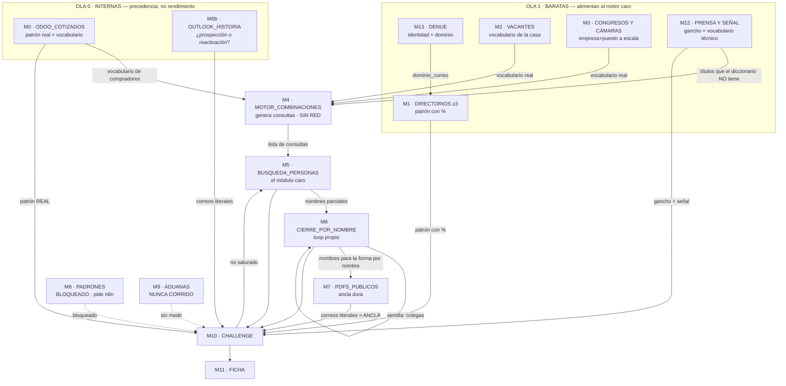

# Módulos de la búsqueda de contactos — contratos, orden y challenge

**Versión 1.1 · DISEÑO. Nada de esto está construido.**
Documento hermano de [`busqueda-encadenada-contactos.md`](busqueda-encadenada-contactos.md) v1.5.

## Por qué existe este documento y no se fusionó con el método

El método narra **por qué** cada paso existe: el disparador medido, la corrección
que lo originó, el contacto concreto que se perdió cuando no estaba. Ese hilo es
lo que §10 protege, y es lo que impide que una versión futura deshaga una
corrección sin darse cuenta.

Un documento de contratos narra otra cosa: **qué entra, qué sale y qué rompe**.

**Fusionarlos destruiría uno de los dos.** Un contrato con la historia adentro
deja de ser legible para quien va a implementarlo; una historia con contratos
adentro deja de contar por qué. Así que el método sigue siendo la fuente de
verdad del *porqué*, y esto es la fuente de verdad del *cómo se corre*.

> **Regla de convivencia:** si los dos se contradicen, **manda el método** y este
> documento está desactualizado. Nunca al revés.

---

## Lo que la auditoría encontró antes de diseñar

Ocho hallazgos. Los tres primeros son de fondo y son la razón de ser de este
documento.

### 1 · El método tiene dos espinas dorsales compitiendo

**§3 es "configuraciones" y §4 es "fases".** Pero §3.2 (vacantes) y §3.5 (PDFs)
**no son variantes de forma**: tienen entrada, salida y momento propios. Están en
§3 porque se agregaron ahí, no porque pertenezcan ahí.

**Consecuencia real:** el lugar de un paso depende de **cuándo se agregó**, no de
**qué es**. Y eso no se nota leyendo, se nota implementando.

### 2 · El bloque "Orden inviolable" está incompleto

Lista ocho pasos y **no menciona ni vacantes ni PDFs** — dos de las capas que más
rindieron. Quien implemente leyendo sólo ese bloque —que es exactamente lo que
alguien con prisa va a leer— **corre una cascada sin las dos fuentes nuevas**.

Es el bloque más citado del documento y el más desactualizado.

### 3 · Las dependencias existen, pero sólo como prosa

El método ya dice, en frases sueltas y correctas:

- que los títulos de vacantes *"entran como piezas nuevas al motor"* (§3.2);
- que la Fase 0 entrega *"el patrón de correo real de cada cuenta"* (§4);
- que el *"puede presentarte a X personas"* de Fase 3 *"entra como semilla nueva"*.

**Las tres son aristas de un grafo de dependencias que nadie dibujó.** No hay
forma de mirar un paso y saber qué necesita tener antes de correr. Por eso se
corre a ciegas, y por eso se desperdician consultas.

### 4 · Hay DOS escalas llamadas "niveles" y no son la misma

| Dónde | Escala | Qué mide |
|---|---|---|
| §5 | ROBUSTO · SÓLIDO · CANDIDATO | **confianza** del dato |
| §8.1 | CONFIRMADOS · PARCIALES · PUESTOS-OBJETIVO | **completitud** del hallazgo |

Las dos se llaman igual. Peor: **el orquestador usa una tercera**
—`verificado · supuesto · no_encontrado · contradicho`— y **ninguna de las dos del
método tiene el estado de conflicto que el orquestador sí tiene.**

### 5 · El challenge está ilustrado, no definido

§5 da **un ejemplo** —vacante cruzada con ex-titular— y nada más. No hay regla de
qué se cruza contra qué.

**Y eso costó un error real.** La ficha de Cuprum salió afirmando *"patrón 100%,
el más limpio de las ocho"*. Era falso: venía de **un solo directorio**. Al
contrastar, otro da `cuprum.com` al 45% y reporta además `verzatec.com` —empresa
hermana— al 20%. **El error no lo atrapó ninguna regla; se corrigió por suerte,
en una corrida posterior que buscaba otra cosa.**

### 6 · §6 no tiene los límites medidos más recientes

Faltan dos, y los dos se midieron el 20-sep-2026: que `filetype:pdf` **no se
respeta de forma confiable**, y que `WebFetch` bloqueado convierte a los padrones
públicos en documentos que **se ven existir pero no se leen**.

### 7 · No hay tasa de rendimiento por paso en ninguna parte

El documento dice "medido" muchas veces y las mediciones son reales, pero viven
**dispersas como anécdotas en prosa**. Nadie puede responder *"¿qué módulo rinde
más por consulta?"* sin releer las 690 líneas.

### 8 · Duplicación silenciosa con el orquestador

`SKILL.md` ya define la regla de dos raíces, el modelo de procedencia y la llave
operativa `dominio_correo + ciudad + CP`. El método **redefine la primera con
otros nombres**. Si divergen, nadie se entera.

---

## Los módulos

Cada módulo tiene el mismo contrato: **nombre · entrada · salida · fuentes ·
criterio de agotado · rendimiento medido · a quién alimenta**.

El criterio de agotado es lo que permite **correr, testear y medir cada uno por
separado** — sin él, un módulo no se puede cerrar y la cascada no se puede
paralelizar.

---

### M0 · `ODOO_COTIZADOS`

> La capa de mayor valor del método, y la que falló en la última corrida.

| | |
|---|---|
| **Entrada** | razón social canónica · `dominio_correo` |
| **Salida** | contactos ya cotizados con `function` · **patrón de correo real** · vocabulario de puestos reales |
| **Fuentes** | Odoo `res.partner` (`is_company=false`, con `function` y `parent_id`) |
| **Agotado** | recorridos todos los contactos de la cuenta |
| **Alimenta** | M1 (contraste de patrón) · M4 (vocabulario) · M10 (ancla dura) |
| **Coste** | ≤10 RPC por planta. Ligero: corre a cualquier hora |

**Rendimiento medido:** 59 contactos, con clusters completos de cuenta —una con
~16, otra con ~8— y patrón de correo confirmado por datos duros.

> **Y el fallo, que también es una medición:** en la corrida del 18-sep-2026
> devolvió **cero**, porque el servidor MCP se desconectó a media corrida. Un
> módulo se mide por lo que da **y** por lo que pasa cuando no está.

---

### M0b · `OUTLOOK_HISTORIA`

> **El módulo con mayor rendimiento por consulta de todos. No estaba aislado como
> paso propio.**

| | |
|---|---|
| **Entrada** | nombre de empresa · dominio |
| **Salida** | historia de cuenta · hilos abiertos sin cerrar · invitaciones de LinkedIn · **correos reales literales** · pertenencias a cámara |
| **Fuentes** | Outlook (lectura) — buzón propio |
| **Agotado** | una consulta por empresa + una por cada nombre fuerte |
| **Alimenta** | M10 (ancla dura) · **y decide si la cuenta es prospección o reactivación** |
| **Coste** | lectura, sin costo, sin cuota |

**Rendimiento medido (18-sep-2026): 8 consultas cambiaron 4 de 8 fichas.**

- un **correo real verificado** (`ana.villagomez@cuprum.com`) con respuesta del otro lado;
- una cuenta **reclasificada de prospecto a cliente** — aparecía en la presentación comercial propia;
- una **invitación sin responder** de siete meses, con 159 contactos en común;
- una **puerta institucional** (CAINTRA) que aplica a tres cuentas a la vez.

> **Por qué va primero, y es la decisión de orden más rentable del diseño:**
> prospectar en frío una cuenta que ya está tibia es el error más caro de la
> cascada. Cuesta ocho consultas evitarlo.

---

### M1 · `DIRECTORIOS`

| | |
|---|---|
| **Entrada** | `dominio_correo` |
| **Salida** | **patrón de correo con porcentaje** · organigrama de compras y dirección · nombres enmascarados (`j***@`) · dominios alternos |
| **Fuentes** | **prospeo.io** · RocketReach · LeadIQ · ZoomInfo · **FinalScout** · ContactOut · SignalHire · AeroLeads · Seamless · Clay · Tomba · Datanyze |
| **Agotado** | **≥3 directorios consultados Y contrastados entre sí** |
| **Alimenta** | M4 · M6 · M7 · M10 · y el patrón que **todos** los módulos posteriores reutilizan |

**Rendimiento medido:** 7 de 8 cuentas dieron patrón; 4 nombres que LinkedIn no
dio (Jorge Duque, Víctor López, Luis Alberto Taraco, Ricardo Eric Chavarría).

> **El criterio de agotado dice ≥3 y no "uno que responda" por una razón
> medida:** con un solo directorio salió el "100%" falso de Cuprum. **Un
> directorio es una opinión; tres son un dato.**

**Hallazgo lateral gratis:** la máscara que publican (`j***@lego.com`) **valida el
patrón sin costo** — si la inicial coincide con lo que la regla predice, es una
confirmación regalada. Pasó con Jorge Duque y con Margarita Gutiérrez.

---

### M2 · `VACANTES`

| | |
|---|---|
| **Entrada** | nombre de empresa · ciudad |
| **Salida** | **vocabulario de títulos reales de la casa** · señal caliente · puestos-objetivo de nivel 3 |
| **Fuentes** | bolsa propia (careers) · Indeed · OCC · Glassdoor · SimplyHired · Jooble |
| **Agotado** | bolsa propia + 2 agregadores, sin títulos nuevos |
| **Alimenta** | **M4, antes de que M4 corra** · M10 (señal de transición) |

**Rendimiento medido:** 9 puestos-objetivo con título real de la casa en 8
cuentas. **Cuatro de los ocho cruces del challenge se sostienen en una vacante
abierta.**

> **Ojo con la exclusión, que es por forma:** las consultas que buscan **personas**
> llevan `-jobs -empleos -vacantes`. Ésta **no**. Aplicar la exclusión a todo deja
> ciego este módulo — y con él, al motor que se alimenta de su vocabulario.

---

### M3 · `CONGRESOS` *(nuevo)*

> Generador de puestos-objetivo a escala, y **limpio de dato personal desde el
> origen**.

| | |
|---|---|
| **Entrada** | giro industrial · región |
| **Salida** | **empresa + puesto, sin nombres**, en volumen · vocabulario real de la industria |
| **Fuentes** | **CMC México** (asistentes, programa, revista) · **CAINTRA** (*Café con el experto*, cohortes de socios) · **CLAUT** (clúster automotriz NL) · **Supply Hub NL** · **Clúster de Herramentales** |
| **Agotado** | última edición publicada + la anterior |
| **Alimenta** | M4 (vocabulario) · nivel 3 de la ficha, directo |

**Rendimiento medido (parcial):** un solo documento —asistentes de CMC México
2019— trae país, estado, empresa y puesto. La edición 17 (2024) reporta **más de
600 asistentes, 92% de perfil medio y alto**.

> **Por qué es el módulo más limpio del catálogo:** el organizador **ya publicó
> sólo empresa y puesto**. No hay nombre que filtrar, no hay celular que decidir
> si tocar. El límite de privacidad de §3.5 no se activa porque no hay nada que
> limitar.

**No medido todavía:** cuántos puestos-objetivo útiles produce por cuenta del
padrón. La lista se vio; no se cruzó contra las ocho cuentas.

---

### M12 · `PRENSA_Y_SENAL` *(faltaba — y produjo las ocho señales)*

> **El hueco más grave de la v1.0 de este documento.** El módulo que generó el
> argumento comercial de las ocho fichas **no tenía contrato**.

| | |
|---|---|
| **Entrada** | nombre de empresa · ciudad · giro |
| **Salida** | **el gancho**: proyecto, monto, fecha, ventana · **y vocabulario técnico específico de esa planta** |
| **Fuentes** | Vanguardia Industrial · Cluster Industrial · Somos Industria · Solili · México Industry · El Financiero · Milenio · boletines del gobierno del estado |
| **Agotado** | última nota relevante de los 24 meses previos, más el sitio propio de la empresa |
| **Alimenta** | **M4 (vocabulario)** · M10 (cruces C6 y C7) · M11 (el argumento) |

**Rendimiento medido (18-sep-2026): las ocho señales calientes de las ocho
cuentas salieron de aquí.** 205 MDD de LEGO · 633 MDP de Ragasa · 200 MDD de
Cuprum · 2,000 MDD de Bimbo · 120 MDD de Navistar · 500 MDP de Amazon.

> **Y el hallazgo que decide dónde va este módulo.** La prensa no sólo da el
> argumento: **da títulos que el diccionario genérico no tiene**, y son los que
> encuentran al comprador real.
>
> | Lo que dijo la nota | El título a buscar, ausente de §3.4 |
> |---|---|
> | cogeneración de 19.2 MW con vapor | *jefe de calderas · servicios auxiliares* |
> | anodizado en extrusión nueva | *tratamiento de superficie* |
> | ampliación de pintura de cabinas | *superintendente de pintura* |
>
> **Los tres salieron de la nota, no del diccionario.** Por eso M12 va en la ola
> 1 y **alimenta a M4 igual que las vacantes**. Correrlo al final es tener el
> argumento cuando ya se gastaron las consultas buscando genéricos.

---

### M13 · `DENUE_PADRON` *(faltaba como módulo)*

| | |
|---|---|
| **Entrada** | entidad federativa · `codigo_act` del giro |
| **Salida** | identidad · ubicación · tamaño · **`dominio_correo`** — la entrada de M1 y media llave operativa |
| **Fuentes** | corte del DENUE. Detalle en [`denue-padron.md`](denue-padron.md) |
| **Agotado** | corte vigente cargado y empatado |
| **Alimenta** | **M1** (le da el dominio) · M10 (cruce C5) |

**Rendimiento medido:** dominio presente en **112 de 143 plantas** del corte. El
diccionario de dominio a razón social que produce **es un activo del proyecto**,
porque la razón social del padrón casi nunca es la marca.

> **Su posición depende del modo**, y es el único módulo del catálogo que se
> mueve: en **modo lote** va arriba de todo, porque elige qué planta se trabaja;
> en **modo señal** va después de M12, a confirmar la planta que la nota nombró.

**Cuidado medido:** el corte viene en **Latin-1**. Leerlo como UTF-8 rompe
empates en silencio — pasó con `RASTRO EMPACADORA TREVIÑO`: 86 de 87 claves
pegaban y esa una fallaba sin un solo error.

---

### M4 · `MOTOR_COMBINACIONES`

> **El único módulo que se testea sin tocar una sola fuente.** Es el Caso C.

| | |
|---|---|
| **Entrada** | diccionario §3.4 **+ vocabulario de M2, M3 y M12** + geografía + idioma |
| **Salida** | **lista de consultas** — no resultados |
| **Fuentes** | ninguna. Es generación pura |
| **Agotado** | producto completo generado: piezas × niveles × credenciales × geografía × idioma × forma |
| **Alimenta** | M5 |
| **Coste** | cero red |

**Rendimiento medido:** la combinación de dos palabras —raíz + nivel— trajo al
gerente de facilities responsable de la compra; **la raíz suelta no lo trajo.**

> **La dependencia dura de todo el diseño:** M4 **no debe correr antes que M2, M3
> y M12**. **Medido: tres de las ocho cuentas necesitaban un título que sólo la
> prensa dio.** Su salida vale lo que valga su vocabulario de entrada, y el vocabulario
> genérico produce consultas genéricas. **Correr M4 con el diccionario pelado y
> luego M5 es la forma más cara de desperdiciar consultas que tiene esta
> cascada** — porque el desperdicio no se ve: las consultas devuelven *algo*.

---

### M5 · `BUSQUEDA_PERSONAS`

| | |
|---|---|
| **Entrada** | consultas de M4 |
| **Salida** | nombres + puestos, sobre todo **técnicos de planta** |
| **Fuentes** | buscador general (con y sin `site:linkedin.com/in`) |
| **Agotado** | **una vuelta completa seca** — no un tope de consultas |
| **Alimenta** | M6 · M7 (les da los nombres) |
| **Coste** | el módulo más caro en consultas de todo el catálogo |

**Rendimiento medido (18-sep-2026):** 64 consultas → ~150 entradas en 8 cuentas.
**Reparto desigual y decreciente:** LEGO 16 consultas → 36 entradas; Amazon 3
consultas → ficha flaca.

> **La curva importa más que el promedio.** Las tres primeras cuentas se llevaron
> 40 de las 64 consultas. Amazon e International no salieron flacas porque tengan
> menos gente: **salieron flacas porque se buscó menos.** Que International diera
> con cuatro consultas la señal más específica de las ocho lo demuestra.

**Táctica medida:** la **búsqueda simple sin operador** es un tipo de consulta
más, no un descarte — quitar `site:` cambia qué indexa el buscador y destapa
páginas de equipo y comunicados que el operador filtra.

---

### M6 · `CIERRE_POR_NOMBRE`

> El único módulo con **loop propio**: su salida vuelve a ser su entrada.

| | |
|---|---|
| **Entrada** | nombres parciales de M5, M1 y M0b |
| **Salida** | apellido cerrado · puesto confirmado · **colegas como semilla nueva** |
| **Fuentes** | buscador por `"[nombre completo] [empresa]"` |
| **Agotado** | ningún nombre nuevo en una vuelta completa |
| **Alimenta** | **a sí mismo** · M7 (forma por nombre) · M10 |

**Límite medido:** buscar por nombre + empresa **reduce** los homónimos pero **no
los elimina**. Se registra sólo cuando el resultado **confirma la empresa
correcta**.

---

### M7 · `PDFS_PUBLICOS`

| | |
|---|---|
| **Entrada** | nombre de empresa **y/o nombre de persona** (de M6) |
| **Salida** | **correos corporativos nominales literales** · teléfonos de oficina · tipo de documento y su fecha |
| **Fuentes** | índice público del buscador |
| **Agotado** | forma por empresa + forma por nombre sobre los nombres fuertes |
| **Alimenta** | **M10 como ANCLA DURA** — valida o desmiente el patrón derivado |

**Rendimiento medido (20-sep-2026): 18 consultas → 3 correos nominales literales
+ 1 teléfono de mesa + 1 corrección de patrón.**

| Lo que sí | Lo que no |
|---|---|
| 3 correos corporativos **literales, no derivados** | **Cero** teléfonos directos de persona nombrada |
| 1 teléfono de mesa de ayuda a proveedores | Cero contactos nominales en 4 de las 8 cuentas |
| Corrigió el patrón falso de Cuprum | Ningún CV con celular apareció |

> **La fuente sirve para algo ligeramente distinto de lo que su nombre sugiere.**
> Se documentó esperando teléfonos directos; lo que entrega son **correos
> nominales**, que son más escasos y más accionables que un conmutador.

**Y va DESPUÉS de M6, no antes:** su forma más productiva es
`filetype:pdf "[nombre]" "[empresa]"`, y esa forma **necesita nombres**. Correrlo
antes deja sólo la forma por empresa, que es la mitad del módulo.

**Tipos de documento que rindieron, en orden:**

| Tipo | Qué entrega |
|---|---|
| Comunicado a proveedores del extranet de una planta | nombre + puesto + correo del responsable de la categoría |
| Manual de credenciales de contratistas | correo del responsable del acceso a planta |
| Guía técnica de integración con proveedores | teléfono de mesa de ayuda |
| Manifestación de impacto ambiental (SINAT) | proyecto, ubicación exacta, quién hizo el estudio |

---

### M8 · `PADRONES_PUBLICOS` *(nuevo — bloqueado)*

| | |
|---|---|
| **Entrada** | región · tipo de entidad pública |
| **Salida** | columnas **literales**: `contacto · puesto · teléfono · correo electrónico` |
| **Fuentes** | municipios de NL (Santiago, Guadalupe) · UANL · CFE · SCJN |
| **Agotado** | *sin definir — no se ha podido correr* |
| **Alimenta** | M10 (ancla dura, en volumen) |

**Rendimiento medido: CERO, y no porque la fuente sea mala.**

> Los documentos **se vieron existir** en la corrida del 20-sep. Traen las
> columnas de contacto en el encabezado. **No se leyó ni uno**, porque `WebFetch`
> está bloqueado contra todo desde esta vía.
>
> **Éste es el mayor rendimiento potencial sin cobrar del catálogo**, y se cobra
> leyendo el PDF **desde n8n**, que sí alcanza donde esta sesión no. Es la única
> pieza del diseño que pide infraestructura, y por eso queda marcada y no
> estimada.

---

### M9 · `ADUANAS`

| | |
|---|---|
| **Entrada** | razón social · RFC |
| **Salida** | qué importa la planta · de qué proveedor · a veces el RFC |
| **Fuentes** | Panjiva · bill of lading |
| **Agotado** | *sin definir* |

**Rendimiento medido: ninguno. Nunca se ha corrido.** Lleva desde la v1.0 en el
método como *bonus* y sigue sin una sola medición. **Se marca así en vez de
estimarse.**

---

### M10 · `CHALLENGE`

Entrada: todo lo anterior. Salida: cada dato con su nivel de confianza.
Su contrato completo está en la matriz de más abajo, que es su especificación.

**Agotado:** cada dato de la ficha pasó por al menos una regla de cruce, o está
marcado como no cruzable.

---

### M11 · `FICHA`

Entrada: la salida de M10. Salida: modo limpio y modo procedencia (§8).
**Agotado:** el checklist de §8.6, línea por línea.

---

## Orden óptimo y dependencias

### Las cuatro reglas de orden, con su porqué

**1 · Las olas 0 y 1 corren completas antes de gastar una consulta cara.**
La **ola 0 es interna** y va primero por **precedencia, no por rendimiento**: en
volumen crudo M5 rinde cinco veces más por consulta que Outlook. Lo que la ola 0
previene es el error que no se paga en consultas sino en credibilidad.
La **ola 1 es externa y barata**, y **todo lo que produce lo consume alguien**.

**2 · M4 nunca antes que M2, M3 y M12.** Es la dependencia dura del diseño. El motor
vale lo que valga su vocabulario, y **el desperdicio de correrlo pelado es
invisible**: las consultas genéricas devuelven resultados genéricos, no errores.

**3 · M7 después de M6, no antes.** La forma por nombre necesita nombres. Antes
de M6, M7 corre a la mitad de su capacidad.

**4 · M0b antes que cualquier redacción.** Saber si la cuenta ya es cliente
cuesta una consulta y evita el error más caro: escribirle en frío a alguien que
ya trabajó con FTS.

---

## Matriz de challenge

**La regla de oro, que es la que faltaba:**

> **Un dato de UNA sola fuente NUNCA se reporta como confirmado.** Sin contraste
> no hay confirmación, por convincente que suene el número que trae.

| # | Qué se cruza | Contra qué | Regla | Resultado |
|---|---|---|---|---|
| **C1** | patrón de correo | **todos** los directorios consultados (≥3) | si 2+ coinciden en dominio y forma → **SÓLIDO**; si difieren >20 puntos de porcentaje, o aparece un **dominio alterno**, o asoma una **empresa hermana** → **EN CONFLICTO** | *el caso Cuprum* |
| **C2** | patrón **derivado** | **correo literal** de M7, M0b o M0 | el literal es **ANCLA DURA**: si lo contradice, el patrón baja a EN CONFLICTO y **manda el literal** | `ana.villagomez@cuprum.com` |
| **C3** | máscara del directorio (`j***@`) | patrón derivado | inicial coincide → **+1 confirmación gratis**; no coincide → EN CONFLICTO | Jorge Duque · Margarita Gutiérrez |
| **C4** | puesto de una persona | directorio **vs** PDF **vs** LinkedIn | 2 de 3 coinciden → **CONFIRMADO**; si lo que difiere es la **geografía**, es conflicto de **entidad** (§5a), no de puesto | *Navistar: ZoomInfo lo pone en USA, el PDF en Escobedo* |
| **C5** | identidad de empresa | `dominio_correo` + ciudad + CP | **nunca por razón social.** El padrón casi nunca coincide con la marca | `grupolala.com` = *Comercializadora de Lácteos* |
| **C6** | vacante activa | ex-titular del puesto | los dos juntos → **señal caliente de transición** | §5 del método |
| **C7** | inversión anunciada | vacantes abiertas del área | los dos juntos → **la obra va adelante del equipo** | Nemak García |
| **C8** | persona encontrada | M0 y M0b | si ya hay historia → **reclasificar la cuenta antes de redactar nada** | Nemak, de prospecto a cliente |
| **C9** | dato con fecha (PDF) | antigüedad del documento | prueba que el correo **existió**, no que la persona **siga**; sin fecha localizable se queda en **CANDIDATO** | §7 del método |

> **Y la regla que cierra la matriz:** cuando dos fuentes chocan, el dato baja a
> **EN CONFLICTO** y se manda a revisión humana. **Nunca se elige en silencio.**
> Elegir en silencio es exactamente lo que produjo el "100%" de Cuprum: alguien
> —yo— tomó la única fuente disponible y la reportó como si fuera consenso.

---

## Niveles de salida

**Escala única de confianza.** Reemplaza la de §5 y se alinea con el orquestador.

| Nivel | Cuándo | En `SKILL.md` |
|---|---|---|
| **CONFIRMADO** | ≥2 fuentes de **raíz distinta** | `verificado` |
| **SÓLIDO** | 1 fuente confiable **+ patrón consistente** | `supuesto` |
| **CANDIDATO** | derivado de patrón, sin ancla | `supuesto` |
| **EN CONFLICTO** | dos fuentes chocan → **revisión humana** | `contradicho` |
| *(hueco)* | agotada la cascada sin resultado | `no_encontrado` |

> **Un correo nominal literal de un PDF pesa más que uno derivado de patrón.** No
> es cuestión de cuántas fuentes: es que uno **es** el dato y el otro es una
> predicción sobre el dato.

**Esta escala mide confianza. La de §8.1 —confirmados, parciales,
puestos-objetivo— mide completitud, y son ejes distintos.** Un puesto-objetivo
sin persona puede ser CONFIRMADO: el título existe, lo publicaron dos fuentes, y
lo que falta es la persona, no la certeza.

---

## Rendimiento medido por módulo

**Ordenado por rendimiento por consulta.** Lo no medido se marca, no se estima.

| Módulo | Consultas | Qué produjo | Por consulta |
|---|---|---|---|
| **M0b · OUTLOOK** | **8** | 4 de 8 fichas cambiadas · 1 correo verificado · 1 cuenta reclasificada · 1 puerta para 3 cuentas | **el más alto del catálogo** |
| **M3 · CONGRESOS** | 2 | 1 documento con 600+ registros de empresa+puesto | alto — **no cruzado contra el padrón todavía** |
| **M2 · VACANTES** | ~8 | 9 puestos-objetivo con título real · sostiene 4 de 8 cruces | alto |
| **M1 · DIRECTORIOS** | ~8 | 7 de 8 patrones · 4 nombres que LinkedIn no dio | alto |
| **M5 · PERSONAS** | **64** | ~150 entradas en 8 cuentas | ~2.3 entradas — **decreciente** |
| **M7 · PDFS** | 18 | 3 correos literales · 1 teléfono · 1 corrección de patrón | ~0.17 correos — **bajo en volumen, alto en calidad** |
| **M0 · ODOO** | 0 | **cero: el MCP se desconectó** | sin medir en esta corrida |
| **M8 · PADRONES** | 3 | **cero cobrado** — documentos vistos, no leídos | **bloqueado por `WebFetch`** |
| **M9 · ADUANAS** | 0 | **nunca corrido** | **sin medir** |
| **M4 · MOTOR** | 0 red | las consultas de M5 | no aplica — no toca red |

### Lo que esta tabla dice y el método no decía

**M5 se lleva el 60% de las consultas y no es el módulo de mayor rendimiento.**
Los baratos de la ola 0 rinden más por consulta que el caro, y además **mejoran
el rendimiento del caro** cuando corren antes.

**Y el módulo más rentable no era ni siquiera un paso del método.** M0b, la
lectura de Outlook, entró como sustituto de emergencia cuando Odoo falló. Ocho
consultas cambiaron la mitad de las fichas.

---

## Límites de entorno, por módulo

Los tres primeros ya están en §6. Los dos últimos se midieron el 20-sep-2026 y
**hay que subirlos a §6**, que es donde alguien los va a buscar.

| Límite | A quién pega | Cómo se rodea |
|---|---|---|
| El buscador de servidor ve menos que un humano logueado en Monterrey | M5 · M6 · M7 | **geografía en el texto** del query: corrige 70-80%. No iguala al humano |
| `uule` por URL no funciona | M5 · M6 | no se rodea. Opción de pago: SerpAPI / DataForSEO, probar su tier gratuito antes |
| Railway es datacenter: un headless propio sufre el mismo sesgo | M5 · M6 | sólo con proxies residenciales mexicanos |
| **`filetype:pdf` no se respeta de forma confiable** | **M7 · M8** | reformular **sin el operador** y filtrar por dominio del resultado. Cuando pega, pega bien |
| **`WebFetch` bloqueado contra todo** | **M7 · M8** | **leer el PDF desde n8n**, no desde esta vía. Es la única pieza del diseño que pide infraestructura |

---

## Lo que no se ha podido medir

Se dice completo en vez de estimarse:

- **M8 · padrones públicos** — rendimiento potencial alto, cobrado cero. Bloqueado por `WebFetch`.
- **M9 · aduanas** — cero mediciones desde la v1.0 del método.
- **M3 · congresos** — la fuente se vio; **no se cruzó contra las ocho cuentas**.
- **M0 · Odoo** — la última corrida devolvió cero por caída del MCP, no por la fuente.
- **La saturación nunca se ha declarado en ninguna cuenta.** No hay una sola medición de qué pasa al correr el producto completo del motor sobre una empresa, porque nunca se ha corrido completo.

> Esa última línea es la más incómoda de este documento y por eso va escrita: **la
> tasa de efectividad —contactos correctos sobre contactos reales existentes— no
> se puede calcular todavía**, porque falta el denominador. Nadie sabe cuánta
> gente hay realmente en ninguna de las ocho cuentas. Lo que sí se puede medir
> hoy, y es lo que esta tabla mide, es **rendimiento por consulta**.

---

## Fuentes descartadas

**La tabla completa, con la razón de cada descarte, vive en §11 del método.** Se
mantiene allá y no aquí a propósito: un descarte es una decisión con historia, y
la historia es del método.

Trece entradas en cuatro familias: **prohibidas por riesgo de cuenta** (scraping
de LinkedIn autenticado, cuenta de Google dedicada en servidor), **cerradas por
el proveedor** (API de LinkedIn/SNAP, D&B sin contrato, Google Places sin llave),
**medidas y fallidas** (`uule`, SMTP directo contra el catch-all, filtro de
industria de Lusha, señales de Vibe, DUNS como llave de empate) y **descartadas
por criterio** (lookalikes, DENUE por API con token, CV con celular en volumen).

> **Regla de reingreso:** una fuente sale de esa tabla **sólo con una medición
> nueva**, nunca con una corazonada.
