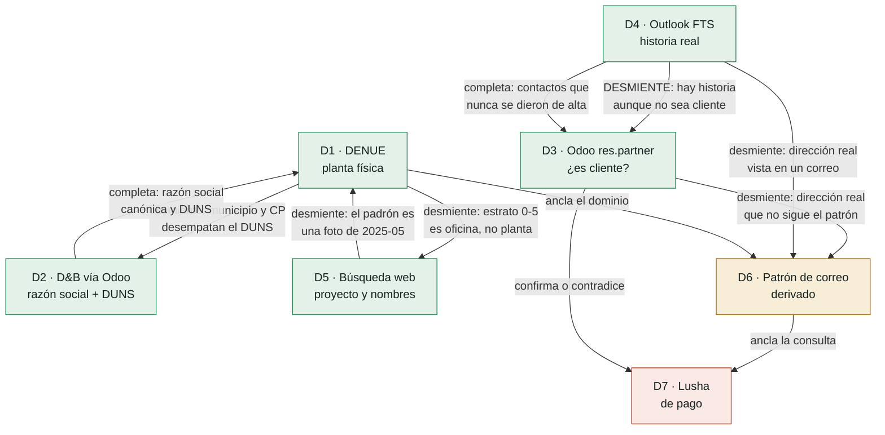

# `/prospectar` — la red de validación cruzada y el esquema de procedencia

**Estado: diseño para revisión. No hay código todavía.**
Fecha: 2026-09-18 · Mediciones de esta sesión, no estimaciones.

---

## 0. Las ocho fuentes, y cuál es primaria para qué

Una fuente es **primaria** para un campo cuando es el registro de origen de ese
dato. Fuera de su campo primario, la misma fuente es solo un testigo más.

| # | Fuente | Primaria para | Costo | Estado medido |
|---|---|---|---|---|
| **D1** | DENUE (padrón local) | SCIAN, estrato, domicilio, municipio, correo corporativo | 0 | ⚠ hay que re-derivarlo — INEGI bloqueado desde aquí |
| **D2** | Odoo `autocomplete_by_name` (D&B) | razón social canónica, DUNS | 0 | ✅ vivo, 429 a las 12 req/10 s |
| **D3** | Odoo `res.partner` | ¿ya es cliente?, contactos ya conocidos | 0 | ✅ vivo, 442 contactos con correo |
| **D4** | Outlook de FTS | historia real, intermediarios, contrapartes | 0 | ✅ vivo, `Mail.Read` + `Mail.Read.Shared` |
| **D5** | Búsqueda web | proyecto, monto, fechas, tecnología | 0 | ✅ vivo |
| **D6** | Patrón de correo (derivado) | — nunca es primaria | 0 | ✅ 97% de consistencia medida |
| **D7** | Lusha | — último recurso | 1–5 créditos | ⚠ 20 créditos, plan free |
| **D8** | Google Places | existencia, teléfono, coordenadas | — | ❌ **no disponible, hueco permanente** |

**D8 no se sustituye en silencio.** Teléfono y coordenadas salen `no_encontrado`
con el motivo escrito: *"Google Places no disponible en el entorno"*. Si la
búsqueda web arroja un teléfono, entra como `supuesto` de D5, nunca como
verificado, porque D5 no es primaria para ese campo.

---

## 1. La red: quién puede desmentir a quién



### Las seis relaciones de desmentido, con su caso medido

**1. D4 desmiente a D3 — el correo contra el CRM.** Medido con Ragasa hoy.
Odoo no lo tiene como cliente; la bandeja tiene cuatro hilos de 2025:
`SOLICITUD DE PROPUESTA PARA SISTEMA DE SUAVIZACION PLANTA RAGASA` (cotización
**SO11134**, 2025-09-12) y `Agua de desperdicio Ragasa` (**SO11126**, filtros,
2025-10-09), con la contraparte en `@ecolab.com` y proveedor `NALCO`.
**Las dos cosas son ciertas**: no es cliente directo *y* ya compró vía Nalco.
La ficha muestra las dos, en paneles separados, y levanta bandera.

**2. D1 desmiente a D2 — el domicilio contra el nombre.** Medido: D&B devolvió
**5 DUNS** con la razón social "Ragasa Industrias, S.A. de C.V.", uno en Jalisco.
La llave no es el DUNS: es **DUNS + ciudad + CP**, y quien manda es el municipio
del DENUE.

**3. D1 desmiente a D5 — el estrato contra el tamaño del grupo.** Un sitio con
estrato 0–5 personas es oficina corporativa, aunque la web diga que el grupo
tiene miles de empleados. Se descarta como objetivo operativo.

**4. D5 desmiente a D1 — la noticia contra la foto.** El padrón es el corte
**2025-05**. Una planta pudo cerrar, mudarse o ampliarse después. Si la web dice
algo posterior, el dato del DENUE baja a `supuesto` y se levanta bandera.

**5. D3 y D4 desmienten a D6 — la dirección real contra el patrón.** Si el
patrón derivado dice `nombre.apellido@` y en Odoo o en la bandeja hay una
dirección real de esa empresa que no encaja, **gana la dirección real**.

**6. D1 ancla a D6 ancla a D7.** Sin dominio confirmado no se gasta un crédito:
el anclaje por dominio es lo único de Lusha que ya validaste.

### La trampa de la independencia

**D2 y una ficha de D&B en la web NO son fuentes independientes.** `autocomplete_by_name`
*es* D&B por debajo. Confirmar el DUNS de Odoo con dnb.com es confirmarlo consigo
mismo. El motor lleva un `origen_raiz` por fuente y **rechaza el ascenso a
verificado cuando dos testigos comparten raíz**.

---

## 2. Cuándo un dato sube a `verificado`

| Situación | Estado resultante |
|---|---|
| Viene de **su fuente primaria** | `verificado` con **1** fuente |
| Viene de una fuente **no primaria** | `supuesto` hasta tener **2 independientes** que coincidan |
| Dos fuentes independientes coinciden | `verificado` |
| Dos fuentes **discrepan** | `contradicho` + bandera. **Se guardan los dos valores.** Nunca se elige en silencio |
| Se buscó y no está | `no_encontrado`, anotando **dónde** se buscó |
| Derivado (D6) | **nunca** pasa de `supuesto` sin una dirección real que lo confirme |

Dos fuentes son independientes si no comparten `origen_raiz`. Raíces:
`inegi`, `dnb`, `fts_interno` (D3 y D4 comparten raíz: las dos son FTS),
`web_abierta`, `lusha`.

> Ojo con la consecuencia: **D3 y D4 comparten raíz.** Que Odoo y el correo digan
> lo mismo no son dos fuentes independientes — es FTS coincidiendo consigo mismo.
> Suben a `verificado` porque D3 y D4 son primarias en sus campos, no por acumulación.

---

## 3. Cuándo se gasta un crédito de Lusha

Las cinco condiciones son **conjuntivas**. Si falla una, no se llama.

1. **Es planta, no oficina.** Estrato ≥ 101 (o ≥ 51 en bebidas y lácteos).
2. **El dominio está `verificado`**, no derivado. Sin dominio confirmado el
   anclaje no funciona y el crédito se tira.
3. **Las fuentes gratis ya corrieron y dejaron el hueco**: cero nombres con
   puesto tras D3, D4 y D5.
4. **Hay ángulo técnico `verificado`** — proyecto, expansión, inversión. Sin
   razón de llamada, un contacto no sirve.
5. **Autorización explícita de esa corrida**, con el saldo mostrado antes de
   llamar.

Además, tres topes duros:
- `revealPhone` (**5 créditos**) está **apagado por omisión**. Se pide aparte.
- Máximo **1 crédito por planta por corrida**.
- Si el saldo baja de **5**, el orquestador deja de ofrecer la opción y lo dice.

---

## 4. El esquema de procedencia

Cada campo de la ficha es un objeto, no un valor suelto:

```jsonc
{
  "campo": "dominio_correo",
  "valor": "ragasa.com.mx",
  "estado": "verificado",            // verificado | supuesto | no_encontrado | contradicho
  "es_pii": false,                   // los PII salen ocultos en modo limpio
  "fuentes": [
    {
      "fuente": "D1_denue",
      "origen_raiz": "inegi",
      "metodo": "padron_local:denue_planta.correoelec",
      "id_evidencia": "denue:19026xxxxxx",
      "fecha_dato": "2025-05-01",     // cuándo fue cierto
      "fecha_consulta": "2026-09-18", // cuándo lo miramos
      "costo_creditos": 0
    },
    {
      "fuente": "D4_outlook",
      "origen_raiz": "fts_interno",
      "metodo": "graph:messages.search",
      "id_evidencia": "AAMkADRj…",
      "fecha_dato": "2025-09-12",
      "fecha_consulta": "2026-09-18",
      "costo_creditos": 0
    }
  ],
  "confirmado_por": ["D4_outlook"],
  "contradicho_por": [],
  "costo_total_creditos": 0,
  "nota": null
}
```

**`fecha_dato` y `fecha_consulta` son distintas y las dos importan.** El DENUE
consultado hoy sigue siendo una foto de mayo 2025. Una nota de prensa de 2024
consultada hoy sigue siendo de 2024. Sin las dos fechas no se puede contestar
meses después por qué la herramienta dijo lo que dijo.

Un campo `contradicho` guarda los dos valores:

```jsonc
{
  "campo": "es_cliente",
  "estado": "contradicho",
  "valor": null,
  "valores_rivales": [
    { "fuente": "D3_odoo",    "valor": false, "nota": "sin coincidencia en res.partner" },
    { "fuente": "D4_outlook", "valor": true,  "nota": "SO11134 y SO11126 en 2025, vía Nalco" }
  ],
  "bandera": "CLIENTE_OCULTO_VIA_INTERMEDIARIO"
}
```

---

## 5. Los dos modos de la ficha

Un solo JSON, dos renders.

- **Modo limpio (Rissia).** Valor + una marca de color. Los campos `es_pii`
  salen ocultos tras un botón. Sin ids de evidencia, sin fechas de consulta.
- **Modo auditoría.** Cada campo se despliega: fuentes, método, ids, las dos
  fechas, quién lo confirmó, quién lo contradijo y cuánto costó.

El modo no cambia el dato. Cambia cuánto del expediente se ve.

---

## 6. Qué se archiva por corrida

Tablas en el esquema `prospeccion` de Postgres, más la copia SQLite del padrón:

| Tabla | Qué guarda |
|---|---|
| `denue_planta` | el padrón de 120, con índices por municipio, SCIAN, estrato y trigram sobre el nombre |
| `corrida` | quién la pidió, cuándo, versión del orquestador, costo total |
| `ficha_campo` | **una fila por campo por corrida**, con el objeto de procedencia completo |
| `fuente_evento` | cada llamada: fuente, método, HTTP, ms, si respondió, costo |
| `bandera` | contradicciones y huecos, con las dos versiones del dato |

`ficha_campo` es append-only. Una corrida nueva no pisa la anterior: se compara
contra ella, y si un dato cambió, eso también es una bandera.

---

## 7. El reporte de cierre de cada corrida

```
FUENTES     consultadas 6 · respondieron 5 · fallaron 1
            D8 Google Places — no disponible en el entorno

DATOS       verificados 11 · supuestos 4 · no encontrados 3 · contradichos 1

BANDERAS    1 · CLIENTE_OCULTO_VIA_INTERMEDIARIO

COSTO       0 créditos Lusha · saldo 20 · 0 escrituras a Odoo
```

---

## 8. Lo que este diseño NO resuelve

- **Teléfono y coordenadas.** Sin D8 se quedan en `no_encontrado`. No se
  sustituyen.
- **El RFC.** `autocomplete_by_name` no lo devuelve — medido en el issue #2.
  Vive tras `enrich_by_duns`, que cobra créditos IAP. Queda `no_encontrado`
  hasta que se decida pagarlo.
- **Nombres con puesto en plantas sin prensa.** Medido: 1 de 3 plantas dio
  nombres operativos por web. Para las otras dos, o hay contacto en Odoo /
  Outlook, o el hueco se declara.
